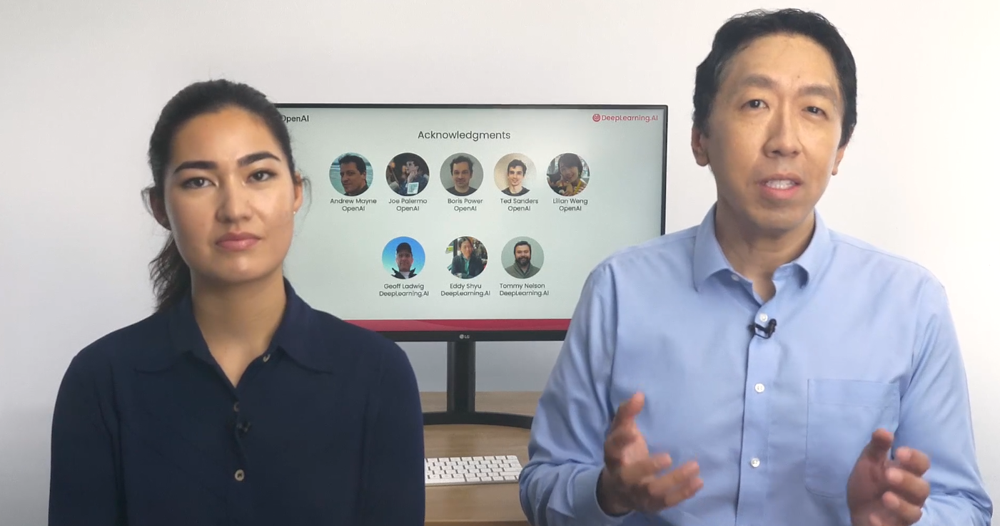

# ChatGPT Prompt Engineering for Developers

[Curso](https://www.deeplearning.ai/short-courses/chatgpt-prompt-engineering-for-developers/)

En **ChatGPT Prompt Engineering for Developers**, aprenderás cómo utilizar un modelo de lenguaje grande (LLM, por sus siglas en inglés) para construir rápidamente aplicaciones nuevas y poderosas. Utilizando la API de OpenAI, podrás desarrollar rápidamente capacidades que aprenden a innovar y crear valor de maneras que antes eran prohibitivas en costos, altamente técnicas o simplemente imposibles hasta ahora. Este breve curso, impartido por Isa Fulford (OpenAI) y Andrew Ng (DeepLearning.AI), describirá cómo funcionan los LLMs, proporcionará las mejores prácticas para la ingeniería de prompts y mostrará cómo las APIs de LLM pueden utilizarse en aplicaciones para una variedad de tareas, incluyendo:

- Resumir (por ejemplo, resumir reseñas de usuarios para brevedad)
- Inferir (por ejemplo, clasificación de sentimientos, extracción de temas)
- Transformar texto (por ejemplo, traducción, corrección de ortografía y gramática)
- Expandir (por ejemplo, escribir correos electrónicos automáticamente)

Además, aprenderás dos principios clave para escribir prompts efectivos, cómo diseñar sistemáticamente buenos prompts y también aprenderás a construir un chatbot personalizado. Todos los conceptos están ilustrados con numerosos ejemplos, que puedes probar directamente en nuestro entorno de bloc de notas Jupyter para obtener experiencia práctica con la ingeniería de prompts.

# Introduction

Bienvenidos a este curso sobre Ingeniería de Prompts con ChatGPT para Desarrolladores. Estoy emocionado de contar con Isa Fulford, miembro del equipo técnico de OpenAI, que ha creado el plugin de recuperación de ChatGPT y ha enseñado a muchas personas cómo usar modelos de lenguaje grande (LLM) en productos.

En el desarrollo de grandes modelos de lenguaje (LLMs), hay dos tipos principales: los LLMs básicos y los LLMs ajustados por instrucciones. Los LLMs básicos predicen la siguiente palabra basada en datos de entrenamiento de texto, mientras que los LLMs ajustados por instrucciones están entrenados para seguir instrucciones.

Por ejemplo, un LLM básico puede completar una historia con información plausible pero incorrecta, mientras que un LLM ajustado por instrucciones proporcionará una respuesta específica y correcta.

Quiero agradecer al equipo de OpenAI y DeepLearning.ai que contribuyó a los materiales de este curso, incluyendo a Andrew Mayne, Joe Palermo, Boris Power, Ted Sanders, y Lillian Weng de OpenAI, así como a Geoff Lodwig, Eddy Shyu y Tommy Nelson de DeepLearning.ai.

Este curso se centrará en las mejores prácticas para los LLMs ajustados por instrucciones, recomendados para la mayoría de sus aplicaciones. Veremos cómo dar instrucciones claras y específicas a los LLMs para obtener mejores resultados.
