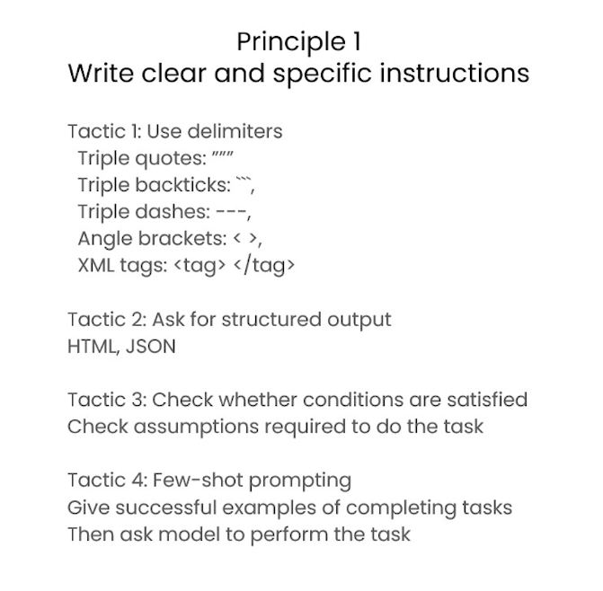

# ChatGPT Prompt Engineering for Developers


[Curso](https://www.deeplearning.ai/short-courses/chatgpt-prompt-engineering-for-developers/)

En **ChatGPT Prompt Engineering for Developers**, aprenderás cómo utilizar un modelo de lenguaje grande (LLM, por sus siglas en inglés) para construir rápidamente aplicaciones nuevas y poderosas. Utilizando la API de OpenAI, podrás desarrollar rápidamente capacidades que aprenden a innovar y crear valor de maneras que antes eran prohibitivas en costos, altamente técnicas o simplemente imposibles hasta ahora. Este breve curso, impartido por Isa Fulford (OpenAI) y Andrew Ng (DeepLearning.AI), describirá cómo funcionan los LLMs, proporcionará las mejores prácticas para la ingeniería de prompts y mostrará cómo las APIs de LLM pueden utilizarse en aplicaciones para una variedad de tareas, incluyendo:

- Resumir (por ejemplo, resumir reseñas de usuarios para brevedad)
- Inferir (por ejemplo, clasificación de sentimientos, extracción de temas)
- Transformar texto (por ejemplo, traducción, corrección de ortografía y gramática)
- Expandir (por ejemplo, escribir correos electrónicos automáticamente)


Además, aprenderás dos principios clave para escribir prompts efectivos, cómo diseñar sistemáticamente buenos prompts y también aprenderás a construir un chatbot personalizado. Todos los conceptos están ilustrados con numerosos ejemplos, que puedes probar directamente en nuestro entorno de bloc de notas Jupyter para obtener experiencia práctica con la ingeniería de prompts.


# 1 Introduction


Bienvenidos a este curso sobre Ingeniería de Prompts con ChatGPT para Desarrolladores. Estoy emocionado de contar con Isa Fulford, miembro del equipo técnico de OpenAI, que ha creado el plugin de recuperación de ChatGPT y ha enseñado a muchas personas cómo usar modelos de lenguaje grande (LLM) en productos.


En el desarrollo de grandes modelos de lenguaje (LLMs), hay dos tipos principales: los LLMs básicos y los LLMs ajustados por instrucciones. Los LLMs básicos predicen la siguiente palabra basada en datos de entrenamiento de texto, mientras que los LLMs ajustados por instrucciones están entrenados para seguir instrucciones.

Por ejemplo, un LLM básico puede completar una historia con información plausible pero incorrecta, mientras que un LLM ajustado por instrucciones proporcionará una respuesta específica y correcta.


Quiero agradecer al equipo de OpenAI y DeepLearning.ai que contribuyó a los materiales de este curso, incluyendo a Andrew Mayne, Joe Palermo, Boris Power, Ted Sanders, y Lillian Weng de OpenAI, así como a Geoff Lodwig, Eddy Shyu y Tommy Nelson de DeepLearning.ai.


Este curso se centrará en las mejores prácticas para los LLMs ajustados por instrucciones, recomendados para la mayoría de sus aplicaciones. Veremos cómo dar instrucciones claras y específicas a los LLMs para obtener mejores resultados.

# 2 Guidelines

> Notebook completo aquí: [l2-guidelines.ipynb](notebooks/l2-guidelines.ipynb)

## Introducción a las Directrices de Prompting


En el notebook se explican varias directrices importantes para la creación de prompts efectivos. A continuación, se presentan algunas de las secciones más importantes:

## Principio 1: Escribir instrucciones claras y específicas


### Táctica 1: Usar delimitadores
- Comillas triples: ```"""
- Backticks triples: ```'''
- Guiones triples: ---
- Corchetes angulares: <>
- Etiquetas XML: <tag> </tag>


### Evitar Inyecciones de Prompt

Para evitar inyecciones de prompt, delimitar claramente el texto que se debe resumir o procesar.

## Principio 2: Dar tiempo al modelo para pensar


### Táctica 1: Especificar los pasos para completar una tarea
- Paso 1: ...
- Paso 2: ...
- Paso N: ...

### Táctica 2: Instruir al modelo a que desarrolle su propia solución antes de llegar a una conclusión



## Proceso Iterativo

El proceso iterativo implica:
- Probar algo nuevo.
- Analizar dónde el resultado no coincide con lo esperado.
- Aclarar las instrucciones y dar más tiempo para pensar.
- Refinar los prompts con varios ejemplos.


# 3 Desarrollo Iterativo de Prompts

## Introducción

En esta sección, aprenderemos sobre el desarrollo iterativo de prompts. Este proceso implica ajustar y refinar continuamente los prompts para obtener mejores resultados de los modelos de lenguaje. A continuación se presentan los elementos más importantes del notebook y las imágenes proporcionadas.

> Notebook completo aquí: [l3-iterative-prompt-development.ipynb](notebooks/l3-iterative-prompt-development.ipynb)

## Ciclo Iterativo de Desarrollo de Prompts

-

Esta imagen muestra el ciclo iterativo del desarrollo de prompts, que incluye las siguientes etapas:
1. **Idea**: Formular una idea inicial para el prompt.
2. **Implementación**: Crear el prompt y aplicar los datos o el código necesario.
3. **Resultado Experimental**: Obtener resultados y analizarlos.
4. **Análisis de Errores**: Identificar errores y áreas de mejora.

## Directrices para Prompts

-

Las directrices para crear prompts efectivos incluyen:
- Ser claro y específico.
- Analizar por qué el resultado no da el output deseado.
- Refinar la idea y el prompt.
- Repetir el proceso.


## Proceso Iterativo

-

El proceso iterativo implica:
- Probar algo nuevo.
- Analizar dónde el resultado no coincide con lo esperado.
- Aclarar las instrucciones y dar más tiempo para pensar.
- Refinar los prompts con varios ejemplos.

## Contenido del Notebook

### Explicaciones en el Notebook

En el notebook se explican varias técnicas y estrategias para desarrollar prompts iterativos. A continuación, se presentan algunas de las secciones más importantes:

- **Introducción a la Ingeniería de Prompts**: Explicación sobre la importancia de crear buenos prompts y cómo impactan en los resultados obtenidos de los modelos de lenguaje.
- **Ciclo de Desarrollo Iterativo**: Detalles sobre cada una de las etapas del ciclo iterativo y cómo implementar mejoras en cada iteración.
- **Directrices para Crear Prompts**: Consejos y mejores prácticas para redactar prompts efectivos y claros.
- **Análisis de Resultados y Errores**: Métodos para evaluar los resultados obtenidos y cómo identificar y corregir errores comunes.

### Código de Ejemplo en el Notebook

El notebook incluye varios ejemplos de código para ilustrar cómo aplicar las técnicas descritas. Aquí hay algunos fragmentos de código:

```python
import openai

openai.api_key = "YOUR_API_KEY"

response = openai.Completion.create(
  engine="text-davinci-003",
  prompt="Escribe un poema sobre la naturaleza",
  max_tokens=100
)
print(response.choices[0].text.strip())
```

Este código muestra cómo utilizar la API de OpenAI para generar texto a partir de un prompt simple. Se pueden realizar múltiples iteraciones sobre este prompt para mejorar la calidad del poema generado.

```python
def analyze_prompt(prompt):
    # Análisis del prompt para identificar áreas de mejora
    pass

def refine_prompt(prompt):
    # Refinar el prompt basado en el análisis
    pass

# Ejemplo de uso
initial_prompt = "Describe the benefits of renewable energy."
refined_prompt = refine_prompt(analyze_prompt(initial_prompt))
print(refined_prompt)
```
Este fragmento de código ilustra un proceso iterativo básico para analizar y refinar prompts.

# 4 Summarizing
En esta lección, aprenderás a resumir textos con un enfoque en temas específicos. El objetivo es poder extraer la información más relevante de un texto dado y presentarla de manera concisa.

## Configuración
Primero, configuramos el entorno importando las librerías necesarias y cargando la clave API de OpenAI desde un archivo `.env`. Esto es esencial para autenticar nuestras solicitudes a la API de OpenAI.

```python
import openai
import os

from dotenv import load_dotenv, find_dotenv
_ = load_dotenv(find_dotenv()) # lee el archivo .env local

openai.api_key  = os.getenv('OPENAI_API_KEY')
```

## Función para obtener resúmenes
Se define una función llamada `get_completion` que toma un prompt y un modelo (por defecto "gpt-3.5-turbo") y devuelve la respuesta del modelo de OpenAI. La función crea un mensaje con el rol de "usuario" y el contenido del prompt, luego llama a la API de OpenAI para obtener la respuesta.

```python
def get_completion(prompt, model="gpt-3.5-turbo"):
    messages = [{"role": "user", "content": prompt}]
    response = openai.ChatCompletion.create(
        model=model,
        messages=messages,
        temperature=0, # este es el grado de aleatoriedad de la salida del modelo
    )
    return response.choices[0].message["content"]
```

## Texto a resumir
Se proporciona un ejemplo de revisión de producto (`prod_review`) que será utilizado para generar resúmenes. Este texto describe una experiencia con un juguete de peluche.

```python
prod_review = '''
Got this panda plush toy for my daughter's birthday, 
who loves it and takes it everywhere. It's soft and 
super cute, and its face has a friendly look. It's 
a bit small for what I paid though. I think there 
might be other options that are bigger for the 
same price. It arrived a day earlier than expected, 
so I got to play with it myself before I gave it 
to her.
'''
```

## Resumir con un límite de palabras/frases/caracteres
Aquí se muestra cómo generar un resumen con un límite de palabras. El prompt se configura para pedir un resumen de no más de 30 palabras del texto de revisión del producto.

```python
prompt = f'''
Your task is to generate a short summary of a product review from an ecommerce site. 

Summarize the review below, delimited by triple backticks, in at most 30 words. 

Review: ```{prod_review}```
'''

response = get_completion(prompt)
print(response)
```

## Resumir con un enfoque en el envío y la entrega
En esta sección, se modifica el prompt para enfocar el resumen en aspectos relacionados con el envío y la entrega del producto. Se mantiene el límite de 30 palabras, pero se pide que se resalten los detalles sobre el envío.

```python
prompt = f'''
Your task is to generate a short summary of a product review from an ecommerce site to give feedback to the Shipping department. 

Summarize the review below, delimited by triple backticks, in at most 30 words, and focusing on any aspects that mention shipping and delivery of the product. 

Review: ```{prod_review}```
'''

response = get_completion(prompt)
print(response)
```

# 5 Inferring

> El notebook está en: [l5-inferring.ipynb](notebooks%2Fl5-inferring.ipynb)
>

## Introducción a la Inferencia

En este módulo, discutimos cómo los modelos de lenguaje grande (LLMs) pueden realizar tareas de inferencia, como clasificar el sentimiento, extraer etiquetas, nombres y entender el sentimiento de un texto, entre otros. Los LLMs simplifican y aceleran el desarrollo de aplicaciones al permitir la ejecución de múltiples tareas con un solo modelo y una API.

### Ejemplo de Sentimiento de un Producto

Tomemos como ejemplo una revisión de un producto (una lámpara) y veamos cómo podemos clasificar su sentimiento.

#### Revisión de Ejemplo:
```
Needed a nice lamp for my bedroom, and this one had additional storage and not too high of a price point. Got it fast. The string to our lamp broke during the transit and the company happily sent over a new one. Came within a few days as well. It was easy to put together. I had a missing part, so I contacted their support and they very quickly got me the missing piece! Lumina seems to me to be a great company that cares about their customers and products!!
```

#### Prompt para Clasificar Sentimiento
```python
prompt = f'''
What is the sentiment of the following product review, 
which is delimited with triple backticks?

Review text: '''{lamp_review}'''
'''
response = get_completion(prompt)
print(response)
```

#### Resultado:
```
The sentiment of the product review is positive.
```

### Instrucciones Adicionales para Respuestas Concisas

Para obtener una respuesta más concisa, podemos modificar el prompt para que devuelva solo una palabra ("positive" o "negative").

#### Prompt Modificado:
```python
prompt = f'''
What is the sentiment of the following product review, 
which is delimited with triple backticks?

Give your answer as a single word, either "positive" 
or "negative".

Review text: '''{lamp_review}'''
'''
response = get_completion(prompt)
print(response)
```

#### Resultado Conciso:
```
positive
```

## Extracción de Emociones

Los LLMs también pueden listar emociones expresadas en una revisión.

#### Prompt para Emociones:
```python
prompt = f'''
Identify a list of emotions that the writer of the 
following review is expressing. Include no more than 
five items in the list. Format your answer as a list of 
lower-case words separated by commas.

Review text: '''{lamp_review}'''
'''
response = get_completion(prompt)
print(response)
```

#### Emociones Extraídas:
```
happy, satisfied, grateful
```

## Clasificación de Ira

Es útil determinar si una revisión expresa ira, especialmente para atención al cliente.

#### Prompt para Ira:
```python
prompt = f'''
Is the writer of the following review expressing anger?
The review is delimited with triple backticks. 
Give your answer as either yes or no.

Review text: '''{lamp_review}'''
'''
response = get_completion(prompt)
print(response)
```

#### Resultado de Ira:
```
no
```

## Extracción de Información Específica

La extracción de información específica como el ítem comprado y la marca es crucial para análisis detallados.

#### Prompt para Información Específica:
```python
prompt = f'''
Identify the following items from the review:
- Item purchased
- Name of the company that made the item

Format your response as a JSON object with "Item" and "Brand" as keys.

Review text: '''{lamp_review}'''
'''
response = get_completion(prompt)
print(response)
```

#### Resultado en JSON:
```json
{
    "Item": "lamp",
    "Brand": "Lumina"
}
```

## Ejemplo de Artículo y Extracción de Temas

Supongamos que tenemos un artículo ficticio sobre empleados del gobierno y queremos extraer los temas tratados.

#### Artículo de Ejemplo:
```
A recent survey conducted by the government revealed that NASA was the most popular department with a satisfaction rating of 95%. One NASA employee, John Smith, commented on the findings, stating, "I'm not surprised that NASA came out on top. It's a great place to work with amazing people and incredible opportunities. I'm proud to be a part of such an innovative organization."
```

#### Prompt para Temas:
```python
prompt = f'''
Determine five topics that are being discussed in the 
following text, which is delimited by triple backticks.

Make each item one or two words long. 

Format your response as a list of items separated by commas.

Text sample: '''{story}'''
'''
response = get_completion(prompt)
print(response)
```

#### Temas Extraídos:
```
government survey, job satisfaction, NASA, employee satisfaction, federal government
```

## Clasificación Zero-Shot

La clasificación zero-shot permite determinar la presencia de temas sin datos de entrenamiento.

#### Prompt Zero-Shot:
```python
topic_list = [
    "nasa", "local government", "engineering", 
    "employee satisfaction", "federal government"
]

prompt = f'''
Determine whether each item in the following list of 
topics is a topic in the text below, which
is delimited with triple backticks.

Give your answer as list with 0 or 1 for each topic.

List of topics: {", ".join(topic_list)}

Text sample: '''{story}'''
'''
response = get_completion(prompt)
print(response)
```

#### Resultado Zero-Shot:
```
{
    "nasa": 1,
    "local government": 0,
    "engineering": 0,
    "employee satisfaction": 1,
    "federal government": 1
}
```

Con esto, podemos crear alertas y clasificar artículos de manera eficiente.


# 6 Apuntes de Transformación

## Introducción a la Transformación

En este módulo, discutimos cómo los modelos de lenguaje grande (LLMs) pueden transformar su entrada a diferentes formatos, tales como traducir texto a otro idioma, corregir la ortografía y gramática, y transformar formatos como HTML a JSON.

> Notebook: [l6-transforming.ipynb](notebooks%2Fl6-transforming.ipynb)

### Ejemplo de Traducción de Textos

Los LLMs están entrenados con una gran cantidad de texto de diversas fuentes, muchas de las cuales están en diferentes idiomas. Esto les da la capacidad de traducir entre múltiples idiomas.

#### Prompt para Traducción a Español
```python
prompt = f'''
Translate the following English text to Spanish: \
```Hi, I would like to order a blender```
'''
response = get_completion(prompt)
print(response)
```

#### Resultado:
```
Hola, me gustaría ordenar una licuadora
```

#### Prompt para Identificar Idioma
```python
prompt = f'''
Tell me which language this is: \
```Combien coûte le lampadaire?```
'''
response = get_completion(prompt)
print(response)
```

#### Resultado:
```
This is French
```

### Traducciones Múltiples

Podemos traducir un texto a múltiples idiomas a la vez.

#### Prompt para Traducción a Múltiples Idiomas
```python
prompt = f'''
Translate the following text to French and Spanish \
and English pirate: \
```I want to order a basketball```
'''
response = get_completion(prompt)
print(response)
```

#### Resultado:
```
French: Je veux commander un ballon de basket
Spanish: Quiero ordenar un balón de baloncesto
English pirate: I be wantin' to order a basketball
```

### Traducción Formal e Informal

Las traducciones pueden variar dependiendo de la relación entre el hablante y el oyente. Podemos especificar al modelo que traduzca en formas formales e informales.

#### Prompt para Traducción Formal e Informal
```python
prompt = f'''
Translate the following text to Spanish in both the \
formal and informal forms: \
'Would you like to order a pillow?'
'''
response = get_completion(prompt)
print(response)
```

#### Resultado:
```
Formal: ¿Le gustaría ordenar una almohada?
Informal: ¿Te gustaría ordenar una almohada?
```

### Traducción de Mensajes de Usuarios en Múltiples Idiomas

Podemos crear un traductor universal que maneje mensajes de usuarios en diferentes idiomas y los traduzca al inglés y al coreano.

#### Lista de Mensajes de Usuarios
```python
user_messages = [
  "La performance du système est plus lente que d'habitude.",
  "Mi monitor tiene píxeles que no se iluminan.",
  "Il mio mouse non funziona",
  "Mój klawisz Ctrl jest zepsuty",
  "我的屏幕在闪烁"
]
```

#### Código para Traducir Mensajes
```python
for issue in user_messages:
    prompt = f"Tell me what language this is: ```{issue}```"
    lang = get_completion(prompt)
    print(f"Original message ({lang}): {issue}")

    prompt = f'''
    Translate the following text to English \
    and Korean: ```{issue}```
    '''
    response = get_completion(prompt)
    print(response)
```

### Transformación de Tonos

La escritura puede variar según la audiencia. ChatGPT puede ayudar a transformar el tono de un texto.

#### Prompt para Transformación de Tono
```python
prompt = f'''
Translate the following from slang to a business letter: \
"Dude, this is Joe, check out this spec on the standing lamp."
'''
response = get_completion(prompt)
print(response)
```

#### Resultado:
```
Dear Sir/Madam,

This is Joe. Please review the attached specification for the standing lamp.

Best regards,
Joe
```

### Conversión de Formatos

ChatGPT es muy bueno traduciendo entre diferentes formatos, como JSON a HTML.

#### Prompt para Convertir JSON a HTML
```python
prompt = f'''
Translate the following Python dictionary from JSON to an HTML table with column headers and title:
'''
json_data = '''
{
  "employees": [
    {"name": "John Doe", "email": "john@example.com"},
    {"name": "Jane Doe", "email": "jane@example.com"}
  ]
}
'''
prompt += json_data

response = get_completion(prompt)
print(response)
```

#### Código para Mostrar HTML
```python
from IPython.display import display, HTML
display(HTML(response))
```

### Corrección de Ortografía y Gramática

ChatGPT puede corregir errores gramaticales y de ortografía.

#### Lista de Textos con Errores
```python
text = [
  "The girl with the black and white puppies have a ball.",
  "Yolanda has her notebook.",
  "Its going to be a long day. Does the car need it’s oil changed?",
  "Their goes my freedom. There going to bring they’re suitcases.",
  "Your going to need you’re notebook.",
  "That medicine effects my ability to sleep. Have you heard of the butterfly affect?",
  "This phrase is to cherck chatGPT for speling abilitty"
]
```

#### Código para Corregir Textos
```python
for t in text:
    prompt = f'''
    Proofread and correct the following text \
    and rewrite the corrected version. If you don't find \
    any errors, just say "No errors found". Don't use \
    any punctuation around the text: \
    ```{t}```
    '''
    response = get_completion(prompt)
    print(response)
```

### Ejemplo de Corrección de Reseñas

Podemos usar ChatGPT para corregir y mejorar reseñas de productos.

#### Texto de Reseña
```python
text = f'''
Got this for my daughter for her birthday cuz she keeps taking \
mine from my room. Yes, adults also like pandas too. She takes \
it everywhere with her, and it's super soft and cute. One of the \
ears is a bit lower than the other, and I don't think that was \
designed to be asymmetrical. It's a bit small for what I paid for it \
though. I think there might be other options that are bigger for \
the same price. It arrived a day earlier than expected, so I got \
to play with it myself before I gave it to my daughter.
'''
prompt = f"proofread and correct this review: ```{text}```"
response = get_completion(prompt)
print(response)
```

#### Mostrar Diferencias
```python
from redlines import Redlines

diff = Redlines(text,response)
display(Markdown(diff.output_markdown))
```

#### Prompt para Mejorar Reseña
```python
prompt = f'''
proofread and correct this review. Make it more compelling. \
Ensure it follows APA style guide and targets an advanced reader. \
Output in markdown format.
Text: ```{text}```
'''
response = get_completion(prompt)
display(Markdown(response))
```

---

Estos son los apuntes y ejemplos de código del módulo de transformación. Puedes descargarlos y consultarlos para entender mejor cómo aplicar estos conceptos en tus propios proyectos.


# 7 Expanding

[l7-expanding.ipynb](notebooks%2Fl7-expanding.ipynb)

# 8 Chatbot

[l8-chatbot.ipynb](notebooks%2Fl8-chatbot.ipynb)

# The Chat Format

In this notebook, you will explore how you can utilize the chat format to have extended conversations with chatbots personalized or specialized for specific tasks or behaviors.

## Setup


```python
import os
import openai
from dotenv import load_dotenv, find_dotenv
_ = load_dotenv(find_dotenv()) # read local .env file

openai.api_key  = os.getenv('OPENAI_API_KEY')
```


```python
def get_completion(prompt, model="gpt-3.5-turbo"):
    messages = [{"role": "user", "content": prompt}]
    response = openai.ChatCompletion.create(
        model=model,
        messages=messages,
        temperature=0, # this is the degree of randomness of the model's output
    )
    return response.choices[0].message["content"]

def get_completion_from_messages(messages, model="gpt-3.5-turbo", temperature=0):
    response = openai.ChatCompletion.create(
        model=model,
        messages=messages,
        temperature=temperature, # this is the degree of randomness of the model's output
    )
#     print(str(response.choices[0].message))
    return response.choices[0].message["content"]
```


```python
messages =  [  
{'role':'system', 'content':'You are an assistant that speaks like Shakespeare.'},    
{'role':'user', 'content':'tell me a joke'},   
{'role':'assistant', 'content':'Why did the chicken cross the road'},   
{'role':'user', 'content':'I don\'t know'}  ]
```


```python
response = get_completion_from_messages(messages, temperature=1)
print(response)
```

    To get to the other side, forsooth! Oh, 'tis a jest old as time itself!


```python
messages =  [  
{'role':'system', 'content':'You are friendly chatbot.'},    
{'role':'user', 'content':'Hi, my name is Isa'}  ]
response = get_completion_from_messages(messages, temperature=1)
print(response)
```

    Hello Isa! It's nice to meet you. How are you today?


```python
messages =  [  
{'role':'system', 'content':'You are friendly chatbot.'},    
{'role':'user', 'content':'Yes,  can you remind me, What is my name?'}  ]
response = get_completion_from_messages(messages, temperature=1)
print(response)
```

    I'm sorry, but I can't remember personal information about you such as your name. Can I help you with something else?


```python
messages =  [  
{'role':'system', 'content':'You are friendly chatbot.'},
{'role':'user', 'content':'Hi, my name is Isa'},
{'role':'assistant', 'content': "Hi Isa! It's nice to meet you. \
Is there anything I can help you with today?"},
{'role':'user', 'content':'Yes, you can remind me, What is my name?'}  ]
response = get_completion_from_messages(messages, temperature=1)
print(response)
```

    Your name is Isa.


# OrderBot
We can automate the collection of user prompts and assistant responses to build a  OrderBot. The OrderBot will take orders at a pizza restaurant. 


```python
def collect_messages(_):
    prompt = inp.value_input
    inp.value = ''
    context.append({'role':'user', 'content':f"{prompt}"})
    response = get_completion_from_messages(context) 
    context.append({'role':'assistant', 'content':f"{response}"})
    panels.append(
        pn.Row('User:', pn.pane.Markdown(prompt, width=600)))
    panels.append(
        pn.Row('Assistant:', pn.pane.Markdown(response, width=600, style={'background-color': '#F6F6F6'})))
 
    return pn.Column(*panels)

```


```python
import panel as pn  # GUI
pn.extension()

panels = [] # collect display 

context = [ {'role':'system', 'content':"""
You are OrderBot, an automated service to collect orders for a pizza restaurant. \
You first greet the customer, then collects the order, \
and then asks if it's a pickup or delivery. \
You wait to collect the entire order, then summarize it and check for a final \
time if the customer wants to add anything else. \
If it's a delivery, you ask for an address. \
Finally you collect the payment.\
Make sure to clarify all options, extras and sizes to uniquely \
identify the item from the menu.\
You respond in a short, very conversational friendly style. \
The menu includes \
pepperoni pizza  12.95, 10.00, 7.00 \
cheese pizza   10.95, 9.25, 6.50 \
eggplant pizza   11.95, 9.75, 6.75 \
fries 4.50, 3.50 \
greek salad 7.25 \
Toppings: \
extra cheese 2.00, \
mushrooms 1.50 \
sausage 3.00 \
canadian bacon 3.50 \
AI sauce 1.50 \
peppers 1.00 \
Drinks: \
coke 3.00, 2.00, 1.00 \
sprite 3.00, 2.00, 1.00 \
bottled water 5.00 \
"""} ]  # accumulate messages


inp = pn.widgets.TextInput(value="Hi", placeholder='Enter text here…')
button_conversation = pn.widgets.Button(name="Chat!")

interactive_conversation = pn.bind(collect_messages, button_conversation)

dashboard = pn.Column(
    inp,
    pn.Row(button_conversation),
    pn.panel(interactive_conversation, loading_indicator=True, height=300),
)

dashboard
```


<style>.bk-root, .bk-root .bk:before, .bk-root .bk:after {
  font-family: var(--jp-ui-font-size1);
  font-size: var(--jp-ui-font-size1);
  color: var(--jp-ui-font-color1);
}
</style>


<div id='1002'>
  <div class="bk-root" id="83cd49da-e578-4cf7-863e-e9922cdc8b55" data-root-id="1002"></div>
</div>
<script type="application/javascript">(function(root) {
  function embed_document(root) {
    var docs_json = {"0162d6a4-b9d6-4ff7-92a4-c9b1f28af94b":{"defs":[{"extends":null,"module":null,"name":"ReactiveHTML1","overrides":[],"properties":[]},{"extends":null,"module":null,"name":"FlexBox1","overrides":[],"properties":[{"default":"flex-start","kind":null,"name":"align_content"},{"default":"flex-start","kind":null,"name":"align_items"},{"default":"row","kind":null,"name":"flex_direction"},{"default":"wrap","kind":null,"name":"flex_wrap"},{"default":"flex-start","kind":null,"name":"justify_content"}]},{"extends":null,"module":null,"name":"GridStack1","overrides":[],"properties":[{"default":"warn","kind":null,"name":"mode"},{"default":null,"kind":null,"name":"ncols"},{"default":null,"kind":null,"name":"nrows"},{"default":true,"kind":null,"name":"allow_resize"},{"default":true,"kind":null,"name":"allow_drag"},{"default":[],"kind":null,"name":"state"}]},{"extends":null,"module":null,"name":"click1","overrides":[],"properties":[{"default":"","kind":null,"name":"terminal_output"},{"default":"","kind":null,"name":"debug_name"},{"default":0,"kind":null,"name":"clears"}]},{"extends":null,"module":null,"name":"NotificationAreaBase1","overrides":[],"properties":[{"default":"bottom-right","kind":null,"name":"position"},{"default":0,"kind":null,"name":"_clear"}]},{"extends":null,"module":null,"name":"NotificationArea1","overrides":[],"properties":[{"default":[],"kind":null,"name":"notifications"},{"default":"bottom-right","kind":null,"name":"position"},{"default":0,"kind":null,"name":"_clear"},{"default":[{"background":"#ffc107","icon":{"className":"fas fa-exclamation-triangle","color":"white","tagName":"i"},"type":"warning"},{"background":"#007bff","icon":{"className":"fas fa-info-circle","color":"white","tagName":"i"},"type":"info"}],"kind":null,"name":"types"}]},{"extends":null,"module":null,"name":"Notification","overrides":[],"properties":[{"default":null,"kind":null,"name":"background"},{"default":3000,"kind":null,"name":"duration"},{"default":null,"kind":null,"name":"icon"},{"default":"","kind":null,"name":"message"},{"default":null,"kind":null,"name":"notification_type"},{"default":false,"kind":null,"name":"_destroyed"}]},{"extends":null,"module":null,"name":"TemplateActions1","overrides":[],"properties":[{"default":0,"kind":null,"name":"open_modal"},{"default":0,"kind":null,"name":"close_modal"}]},{"extends":null,"module":null,"name":"MaterialTemplateActions1","overrides":[],"properties":[{"default":0,"kind":null,"name":"open_modal"},{"default":0,"kind":null,"name":"close_modal"}]}],"roots":{"references":[{"attributes":{"client_comm_id":"a6a640b7e64949af9698241086855f9b","comm_id":"6f37a3adcb8646b49cbd7e51b82a6313","plot_id":"1002"},"id":"1015","type":"panel.models.comm_manager.CommManager"},{"attributes":{"children":[{"id":"1005"}],"margin":[0,0,0,0],"name":"Row00103"},"id":"1004","type":"Row"},{"attributes":{"children":[{"id":"1007"}],"height":300,"margin":[0,0,0,0],"min_height":300,"name":"Row00108"},"id":"1006","type":"Row"},{"attributes":{"args":{"bidirectional":false,"properties":{"event:button_click":"loading"},"source":{"id":"1005"},"target":{"id":"1006"}},"code":"\n    if ('event:button_click'.startsWith('event:')) {\n      var value = true\n    } else {\n      var value = source['event:button_click'];\n      value = value;\n    }\n    if (typeof value !== 'boolean' || source.labels !== ['Loading']) {\n      value = true\n    }\n    var css_classes = target.css_classes.slice()\n    var loading_css = ['pn-loading', 'arc']\n    if (value) {\n      for (var css of loading_css) {\n        if (!(css in css_classes)) {\n          css_classes.push(css)\n        }\n      }\n    } else {\n     for (var css of loading_css) {\n        var index = css_classes.indexOf(css)\n        if (index > -1) {\n          css_classes.splice(index, 1)\n        }\n      }\n    }\n    target['css_classes'] = css_classes\n    ","tags":[[139800389332176,[null,"event:button_click"],[null,"loading"]]]},"id":"1014","type":"CustomJS"},{"attributes":{"reload":false},"id":"1016","type":"panel.models.location.Location"},{"attributes":{"margin":[5,10,5,10],"max_length":5000,"placeholder":"Enter text here\u2026"},"id":"1003","type":"TextInput"},{"attributes":{"children":[{"id":"1008"},{"id":"1011"}],"margin":[0,0,0,0],"name":"Column00120"},"id":"1007","type":"Column"},{"attributes":{"css_classes":["markdown"],"margin":[5,5,5,5],"name":"Markdown00112","text":"&lt;p&gt;User:&lt;/p&gt;"},"id":"1009","type":"panel.models.markup.HTML"},{"attributes":{"icon":null,"js_event_callbacks":{"button_click":[{"id":"1014"}]},"label":"Chat!","margin":[5,10,5,10],"subscribed_events":["button_click"]},"id":"1005","type":"Button"},{"attributes":{"children":[{"id":"1012"},{"id":"1013"}],"margin":[0,0,0,0],"name":"Row00119"},"id":"1011","type":"Row"},{"attributes":{"children":[{"id":"1009"},{"id":"1010"}],"margin":[0,0,0,0],"name":"Row00114"},"id":"1008","type":"Row"},{"attributes":{"css_classes":["markdown"],"margin":[5,5,5,5],"name":"Markdown00117","text":"&lt;p&gt;Assistant:&lt;/p&gt;"},"id":"1012","type":"panel.models.markup.HTML"},{"attributes":{"css_classes":["markdown"],"margin":[5,5,5,5],"name":"Markdown00110","width":600},"id":"1010","type":"panel.models.markup.HTML"},{"attributes":{"children":[{"id":"1003"},{"id":"1004"},{"id":"1006"}],"margin":[0,0,0,0],"name":"Column00122"},"id":"1002","type":"Column"},{"attributes":{"css_classes":["markdown"],"margin":[5,5,5,5],"name":"Markdown00115","style":{"background-color":"#F6F6F6"},"text":"&lt;p&gt;Hello! Welcome to our pizza restaurant! What can I get for you today?&lt;/p&gt;","width":600},"id":"1013","type":"panel.models.markup.HTML"}],"root_ids":["1002","1015","1016"]},"title":"Bokeh Application","version":"2.4.3"}};
    var render_items = [{"docid":"0162d6a4-b9d6-4ff7-92a4-c9b1f28af94b","root_ids":["1002"],"roots":{"1002":"83cd49da-e578-4cf7-863e-e9922cdc8b55"}}];
    root.Bokeh.embed.embed_items_notebook(docs_json, render_items);
    for (const render_item of render_items) {
      for (const root_id of render_item.root_ids) {
	const id_el = document.getElementById(root_id)
	if (id_el.children.length && (id_el.children[0].className === 'bk-root')) {
	  const root_el = id_el.children[0]
	  root_el.id = root_el.id + '-rendered'
	}
      }
    }
  }
  if (root.Bokeh !== undefined && root.Bokeh.Panel !== undefined) {
    embed_document(root);
  } else {
    var attempts = 0;
    var timer = setInterval(function(root) {
      if (root.Bokeh !== undefined && root.Bokeh.Panel !== undefined) {
        clearInterval(timer);
        embed_document(root);
      } else if (document.readyState == "complete") {
        attempts++;
        if (attempts > 200) {
          clearInterval(timer);
          console.log("Bokeh: ERROR: Unable to run BokehJS code because BokehJS library is missing");
        }
      }
    }, 25, root)
  }
})(window);</script>


```python
messages =  context.copy()
messages.append(
{'role':'system', 'content':'create a json summary of the previous food order. Itemize the price for each item\
 The fields should be 1) pizza, include size 2) list of toppings 3) list of drinks, include size   4) list of sides include size  5)total price '},    
)
 #The fields should be 1) pizza, price 2) list of toppings 3) list of drinks, include size include price  4) list of sides include size include price, 5)total price '},    

response = get_completion_from_messages(messages, temperature=0)
print(response)
```

    {
      "pizza": {
        "type": "pepperoni pizza",
        "size": "large",
        "price": 12.95
      },
      "toppings": [
        {
          "type": "extra cheese",
          "price": 2.00
        },
        {
          "type": "mushrooms",
          "price": 1.50
        }
      ],
      "drinks": [
        {
          "type": "coke",
          "size": "medium",
          "price": 2.00
        }
      ],
      "sides": [],
      "total price": 18.45
    }


