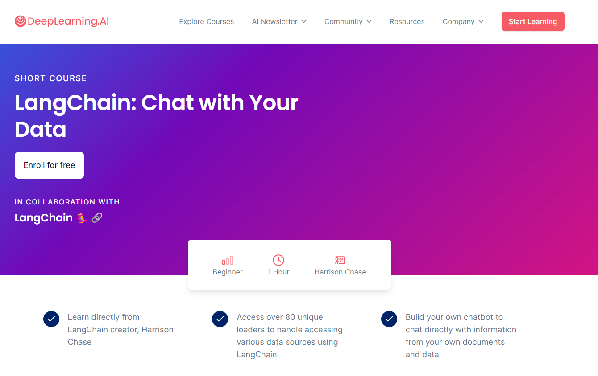
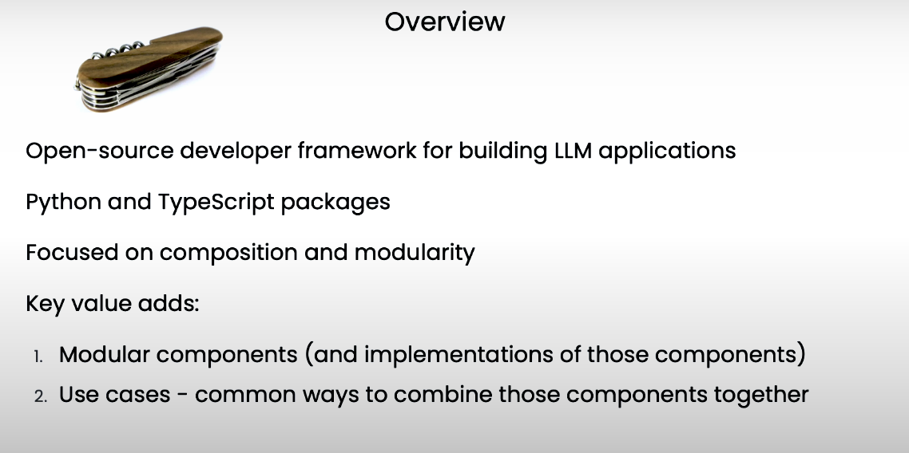
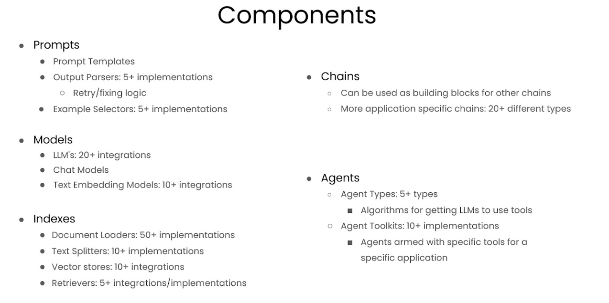
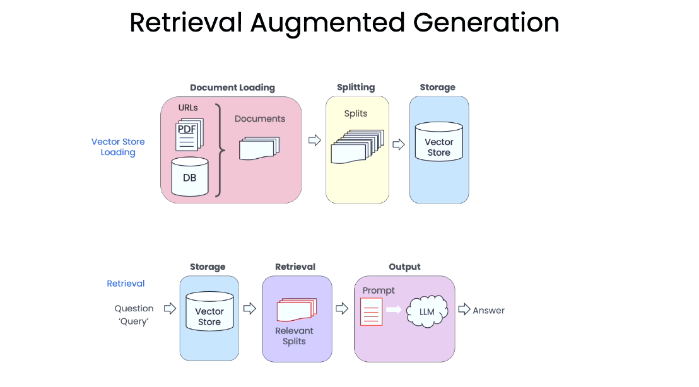
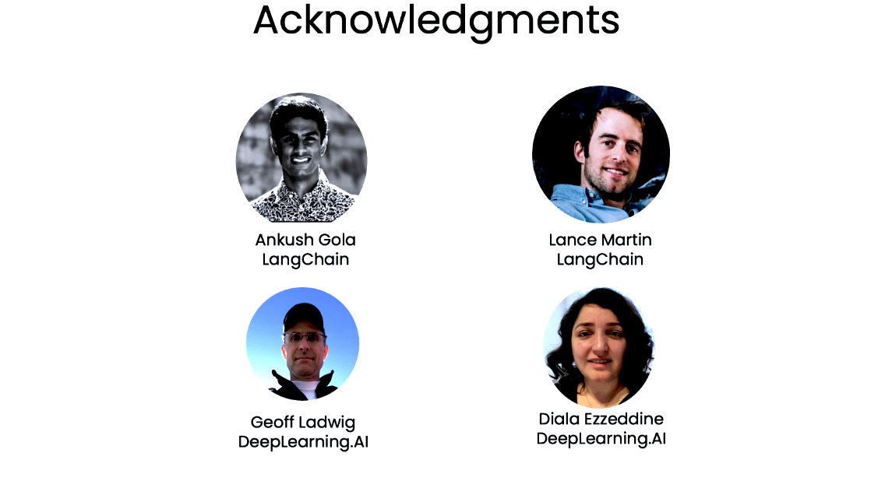
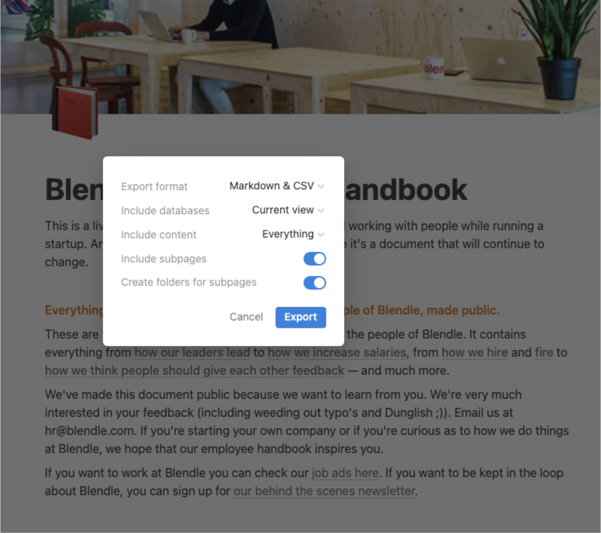

# LangChain: Chat with Your Data



[Curso](https://www.deeplearning.ai/short-courses/chatgpt-prompt-engineering-for-developers/)


## Lo que aprenderás en este curso

Únete a nuestro nuevo curso corto, ¡LangChain: Chatea con tus datos! El curso aborda dos temas principales: (1) Generación Aumentada por Recuperación (RAG), una aplicación común de LLM que recupera documentos contextuales de un conjunto de datos externo, y (2) una guía para construir un chatbot que responda a consultas basadas en el contenido de tus documentos, en lugar de la información que ha aprendido en el entrenamiento.

### Aprenderás sobre:

- **Carga de Documentos**: Aprende los fundamentos de la carga de datos y descubre más de 80 cargadores únicos que LangChain proporciona para acceder a diversas fuentes de datos, incluyendo audio y video.
- **División de Documentos**: Descubre las mejores prácticas y consideraciones para dividir datos.
- **Almacenes de Vectores y Embeddings**: Sumérgete en el concepto de embeddings y explora las integraciones de almacenes de vectores dentro de LangChain.
- **Recuperación**: Comprende técnicas avanzadas para acceder e indexar datos en el almacén de vectores, permitiéndote recuperar la información más relevante más allá de las consultas semánticas.
- **Responder Preguntas**: Construye una solución de respuesta a preguntas en una sola pasada.
- **Chat**: Aprende cómo rastrear y seleccionar información pertinente de conversaciones y fuentes de datos, mientras construyes tu propio chatbot usando LangChain.

Empieza a construir aplicaciones prácticas que te permitan interactuar con datos usando LangChain y LLMs.

### ¿Quién debería unirse?

Desarrolladores familiarizados con Python que estén interesados en desarrollar aplicaciones utilizando Modelos de Lenguaje de Gran Escala como ChatGPT.

# Índice

- [Introduction](#introduction)
- [Document Loading](#document-loading)
- [Document Splitting](#document-splitting)
- [Vectorstores and Embedding](#vectorstores-and-embedding)
- [Retrieval](#retrieval)
- [Question Answering](#question-answering)
- [Chat](#chat)
- [Conclusion](#conclusion)

# Introduction
[Volver al índice](#índice)


En este curso, aprenderás cómo usar LangChain para chatear con tus datos. Este curso se ha creado en colaboración con Harrison Chase, cofundador y CEO de LangChain.

Los modelos de lenguaje de gran escala (LLMs), como ChatGPT, pueden responder preguntas sobre muchos temas. Sin embargo, 
un LLM en aislamiento solo sabe lo que se le ha enseñado durante su entrenamiento, lo que no incluye tus datos personales, 
documentos propietarios de tu empresa, ni datos o artículos escritos después de su entrenamiento. 

Sería útil que tú o tus clientes pudieran tener una conversación con tus propios documentos y obtener respuestas a preguntas 
utilizando información de esos documentos y un LLM. En este curso corto, cubriremos cómo usar LangChain para chatear con 
tus datos. 



LangChain es un marco de desarrollo de código abierto para construir aplicaciones de LLM. LangChain consta de varios 
componentes modulares, así como de plantillas más integrales. Los componentes modulares incluyen prompts, modelos, índices, 
cadenas y agentes.




En este curso, nos enfocaremos en uno de los casos de uso más populares de LangChain: cómo usar LangChain para chatear con 
tus datos. Primero, cubriremos cómo usar los cargadores de documentos de LangChain para cargar datos de una variedad de fuentes. 
Luego, tocaremos cómo dividir estos documentos en partes semánticamente significativas. Este paso de preprocesamiento 
puede parecer simple, pero tiene mucha complejidad.




A continuación, daremos una visión general de la búsqueda semántica, un método básico para obtener información relevante a 
partir de una pregunta del usuario. Este es el método más fácil para comenzar, pero hay varios casos donde falla. 
Revisaremos estos casos y cómo solucionarlos. Luego, mostraremos cómo usar los documentos recuperados para permitir que un 
LLM responda preguntas sobre un documento, pero aún falta una pieza clave para recrear completamente la experiencia de un chatbot.

Finalmente, cubriremos esa pieza faltante, la memoria, y mostraremos cómo construir un chatbot completamente funcional con 
el cual puedas chatear con tus datos.



Este será un curso corto emocionante. Estamos agradecidos con Ankush Gola y Lance Martin del equipo de LangChain por 
trabajar en todos los materiales que escucharás a Harrison presentar más adelante, así como a Geoff Ladwig y Diala Ezzeddine 
del equipo de deeplearning.ai.

En caso de que necesites un repaso sobre los conceptos básicos de LangChain, te animamos a tomar el curso corto anterior sobre 
el desarrollo de aplicaciones con LLM que mencionó Harrison. Ahora, pasemos al siguiente video donde Harrison te mostrará 
cómo usar la conveniente colección de cargadores de documentos de LangChain.


# Document Loading
[Volver al índice](#índice)

> Notebook: [01_document_loading.ipynb](notebooks/01_document_loading.ipynb)

## Nota para los estudiantes
Durante períodos de alta carga, es posible que el cuaderno no responda. Puede parecer que ejecuta una celda, actualizar el número de finalización entre corchetes [#] a la izquierda de la celda, pero es posible que la celda no se haya ejecutado. Esto es particularmente obvio en las declaraciones de impresión cuando no hay salida. Si esto sucede, reinicie el kernel utilizando el comando en la pestaña Kernel.

## Generación aumentada por recuperación
 
En la generación aumentada por recuperación (RAG), un LLM recupera documentos contextuales de un conjunto de datos externo como parte de su ejecución. 

Esto es útil si queremos hacer preguntas sobre documentos específicos (por ejemplo, nuestros archivos PDF, un conjunto de videos, etc.). 


```python
#! pip install langchain
```


```python
import os
import openai
import sys
sys.path.append('../..')

from dotenv import load_dotenv, find_dotenv
_ = load_dotenv(find_dotenv()) # read local .env file

openai.api_key = os.environ['OPENAI_API_KEY']
```

## PDFs

¡Cargue un PDF [transcripción](https://see.stanford.edu/materials/aimlcs229/transcripts/MachineLearning-Lecture01.pdf) del famoso curso CS229 de Andrew Ng! Estos documentos son el resultado de la transcripción automatizada, por lo que las palabras y las oraciones a veces se dividen inesperadamente.


```python
# El curso mostrará las instalaciones de pip que necesitarías para instalar paquetes en tu propia máquina.
# Estos paquetes ya están instalados en esta plataforma y no deben ejecutarse de nuevo.
#! pip install pypdf 
```


```python
from langchain.document_loaders import PyPDFLoader
loader = PyPDFLoader("docs/cs229_lectures/MachineLearning-Lecture01.pdf")
pages = loader.load()
```

Cada página es un `Document`.

Un `Document` contiene texto (`page_content`) y `metadata`.


```python
len(pages)
```


  22


```python
page = pages[0]
```


```python
print(page.page_content[0:500])
```

  MachineLearning-Lecture01  
  Instructor (Andrew Ng): Okay. Good morning. Welcome to CS229, the machine 
  learning class. So what I wanna do today is ju st spend a little time going over the logistics 
  of the class, and then we'll start to talk a bit about machine learning.  
  By way of introduction, my name's Andrew Ng and I'll be instru ctor for this class. And so 
  I personally work in machine learning, and I' ve worked on it for about 15 years now, and 
  I actually think that machine learning i


```python
page.metadata
```


  {'source': 'docs/cs229_lectures/MachineLearning-Lecture01.pdf', 'page': 0}


## YouTube


```python
from langchain.document_loaders.generic import GenericLoader
from langchain.document_loaders.parsers import OpenAIWhisperParser
from langchain.document_loaders.blob_loaders.youtube_audio import YoutubeAudioLoader
```


```python
# ! pip install yt_dlp
# ! pip install pydub
```

**Nota**: Esto puede tardar varios minutos en completarse.


```python
url="https://www.youtube.com/watch?v=jGwO_UgTS7I"
save_dir="docs/youtube/"
loader = GenericLoader(
  YoutubeAudioLoader([url],save_dir),
  OpenAIWhisperParser()
)
docs = loader.load()
```

  [youtube] Extracting URL: https://www.youtube.com/watch?v=jGwO_UgTS7I
  [youtube] jGwO_UgTS7I: Downloading webpage
  [youtube] jGwO_UgTS7I: Downloading ios player API JSON
  [youtube] jGwO_UgTS7I: Downloading android player API JSON


  WARNING: [youtube] YouTube said: ERROR - Precondition check failed.
  WARNING: [youtube] HTTP Error 400: Bad Request. Retrying (1/3)...


  [youtube] jGwO_UgTS7I: Downloading android player API JSON


  WARNING: [youtube] YouTube said: ERROR - Precondition check failed.
  WARNING: [youtube] HTTP Error 400: Bad Request. Retrying (2/3)...


  [youtube] jGwO_UgTS7I: Downloading android player API JSON


  WARNING: [youtube] YouTube said: ERROR - Precondition check failed.
  WARNING: [youtube] HTTP Error 400: Bad Request. Retrying (3/3)...


  [youtube] jGwO_UgTS7I: Downloading android player API JSON


  WARNING: [youtube] YouTube said: ERROR - Precondition check failed.
  WARNING: [youtube] Unable to download API page: HTTP Error 400: Bad Request (caused by <HTTPError 400: 'Bad Request'>); please report this issue on https://github.com/yt-dlp/yt-dlp/issues?q= , filling out the appropriate issue template. Confirm you are on the latest version using yt-dlp -U


  [youtube] jGwO_UgTS7I: Downloading player 84314bef
  [youtube] jGwO_UgTS7I: Downloading m3u8 information
  [info] jGwO_UgTS7I: Downloading 1 format(s): 140
  [download] Destination: docs/youtube//Stanford CS229： Machine Learning Course, Lecture 1 - Andrew Ng (Autumn 2018).m4a
  [download] 100% of  69.76MiB in 00:00:01 at 43.17MiB/s   
  [FixupM4a] Correcting container of "docs/youtube//Stanford CS229： Machine Learning Course, Lecture 1 - Andrew Ng (Autumn 2018).m4a"
  [ExtractAudio] Not converting audio docs/youtube//Stanford CS229： Machine Learning Course, Lecture 1 - Andrew Ng (Autumn 2018).m4a; file is already in target format m4a
  Transcribing part 1!
  Transcribing part 2!
  Transcribing part 3!


  ---------------------------------------------------------------------------

  APIError                 Traceback (most recent call last)

  Cell In[11], line 7
     2 save_dir="docs/youtube/"
     3 loader = GenericLoader(
     4   YoutubeAudioLoader([url],save_dir),
     5   OpenAIWhisperParser()
     6 )
  ----> 7 docs = loader.load()


  File /usr/local/lib/python3.9/site-packages/langchain/document_loaders/generic.py:90, in GenericLoader.load(self)
     88 def load(self) -> List[Document]:
     89   """Load all documents."""
  ---> 90   return list(self.lazy_load())


  File /usr/local/lib/python3.9/site-packages/langchain/document_loaders/generic.py:86, in GenericLoader.lazy_load(self)
     84 """Load documents lazily. Use this when working at a large scale."""
     85 for blob in self.blob_loader.yield_blobs():
  ---> 86   yield from self.blob_parser.lazy_parse(blob)


  File /usr/local/lib/python3.9/site-packages/langchain/document_loaders/parsers/audio.py:51, in OpenAIWhisperParser.lazy_parse(self, blob)
     49 # Transcribe
     50 print(f"Transcribing part {split_number+1}!")
  ---> 51 transcript = openai.Audio.transcribe("whisper-1", file_obj)
     53 yield Document(
     54   page_content=transcript.text,
     55   metadata={"source": blob.source, "chunk": split_number},
     56 )


  File /usr/local/lib/python3.9/site-packages/openai/api_resources/audio.py:57, in Audio.transcribe(cls, model, file, api_key, api_base, api_type, api_version, organization, **params)
     55 requestor, files, data = cls._prepare_request(file, file.name, model, **params)
     56 url = cls._get_url("transcriptions")
  ---> 57 response, _, api_key = requestor.request("post", url, files=files, params=data)
     58 return util.convert_to_openai_object(
     59   response, api_key, api_version, organization
     60 )


  File /usr/local/lib/python3.9/site-packages/openai/api_requestor.py:226, in APIRequestor.request(self, method, url, params, headers, files, stream, request_id, request_timeout)
    205 def request(
    206   self,
    207   method,
    (...)
    214   request_timeout: Optional[Union[float, Tuple[float, float]]] = None,
    215 ) -> Tuple[Union[OpenAIResponse, Iterator[OpenAIResponse]], bool, str]:
    216   result = self.request_raw(
    217     method.lower(),
    218     url,
    (...)
    224     request_timeout=request_timeout,
    225   )
  --> 226   resp, got_stream = self._interpret_response(result, stream)
    227   return resp, got_stream, self.api_key


  File /usr/local/lib/python3.9/site-packages/openai/api_requestor.py:619, in APIRequestor._interpret_response(self, result, stream)
    611   return (
    612     self._interpret_response_line(
    613       line, result.status_code, result.headers, stream=True
    614     )
    615     for line in parse_stream(result.iter_lines())
    616   ), True
    617 else:
    618   return (
  --> 619     self._interpret_response_line(
    620       result.content.decode("utf-8"),
    621       result.status_code,
    622       result.headers,
    623       stream=False,
    624     ),
    625     False,
    626   )


  File /usr/local/lib/python3.9/site-packages/openai/api_requestor.py:679, in APIRequestor._interpret_response_line(self, rbody, rcode, rheaders, stream)
    677 stream_error = stream and "error" in resp.data
    678 if stream_error or not 200 <= rcode < 300:
  --> 679   raise self.handle_error_response(
    680     rbody, rcode, resp.data, rheaders, stream_error=stream_error
    681   )
    682 return resp


  APIError: Timed out generating response. Please try again with a shorter prompt or with `max_tokens` set to a lower value. {
    "error": {
      "message": "Timed out generating response. Please try again with a shorter prompt or with `max_tokens` set to a lower value.",
      "type": "internal_error",
      "param": null,
      "code": "request_timeout"
    }
  }
   500 {'error': {'message': 'Timed out generating response. Please try again with a shorter prompt or with `max_tokens` set to a lower value.', 'type': 'internal_error', 'param': None, 'code': 'request_timeout'}} {'Date': 'Fri, 21 Jun 2024 18:44:57 GMT', 'Content-Type': 'application/json; charset=utf-8', 'Content-Length': '251', 'Connection': 'keep-alive', 'Server': 'gunicorn', 'Vary': 'Origin, Accept-Language', 'x-ratelimit-limit-requests': '500', 'x-ratelimit-remaining-requests': '499', 'x-ratelimit-reset-requests': '120ms', 'x-request-id': '70d69874849557e931677576d6814532', 'strict-transport-security': 'max-age=31536000; includeSubDomains', 'CF-Cache-Status': 'DYNAMIC', 'CF-RAY': '89762445baf067a8-SJC', 'alt-svc': 'h3=":443"; ma=86400', 'X-Frame-Options': 'DENY', 'Content-Language': 'en', 'X-Content-Type-Options': 'nosniff', 'Referrer-Policy': 'same-origin', 'Cross-Origin-Opener-Policy': 'same-origin', 'Set-Cookie': '__cf_bm=2daQp4EN1ivqi8F.Vr5BZzSCJ9eF0Dqdconb_i3zWuk-1718995497-1.0.1.1-scNVVsHevzKcB_MN63kezvwqN_7be7Ml3Re6x2n2fLtQNIVSsLeBCVKJ522sBDPR27BATKAY9kKcXJwt_oRmXw; Domain=.api.openai.com; expires=Fri, 21-Jun-24 19:14:57 GMT; HttpOnly; Path=/; SameSite=None; Secure, _cfuvid=pdTJujNYyFQKkfaH4pANpobh0jvGJwNeMPIVOLdNWK8-1718995497693-0.0.1.1-604800000; Domain=.api.openai.com; HttpOnly; Path=/; SameSite=None; Secure'}


```python
docs[0].page_content[0:500]
```


  ---------------------------------------------------------------------------

  NameError                 Traceback (most recent call last)

  Cell In[12], line 1
  ----> 1 docs[0].page_content[0:500]


  NameError: name 'docs' is not defined


## URLs


```python
from langchain.document_loaders import WebBaseLoader

loader = WebBaseLoader("https://github.com/basecamp/handbook/blob/master/37signals-is-you.md")
```


```python
docs = loader.load()
```


```python
print(docs[0].page_content[:500])
```

## Notion

Sigue los pasos [aquí](https://python.langchain.com/docs/modules/data_connection/document_loaders/integrations/notion) para un ejemplo de sitio de Notion como [este](https://yolospace.notion.site/Blendle-s-Employee-Handbook-e31bff7da17346ee99f531087d8b133f):

* Duplica la página en tu propio espacio de Notion y exporta como `Markdown / CSV`.
* Descomprime el archivo y guárdalo como una carpeta que contenga el archivo markdown para la página de Notion.
 




```python
from langchain.document_loaders import NotionDirectoryLoader
loader = NotionDirectoryLoader("docs/Notion_DB")
docs = loader.load()
```


```python
print(docs[0].page_content[0:200])
```

  # Manual de Empleados de Blendle
   
  Este es un documento vivo con todo lo que hemos aprendido trabajando con personas mientras dirigimos una startup. Y, por supuesto, seguimos aprendiendo. Por lo tanto, es un documento que


```python
docs[0].metadata
```


  {'source': "docs/Notion_DB/Blendle's Employee Handbook e367aa77e225482c849111687e114a56.md"}


# Document Splitting
[Volver al índice](#índice)

# Vectorstores and Embedding
[Volver al índice](#índice)

# Retrieval
[Volver al índice](#índice)

# Question Answering
[Volver al índice](#índice)

# Chat
[Volver al índice](#índice)

# Conclusion
[Volver al índice](#índice)

