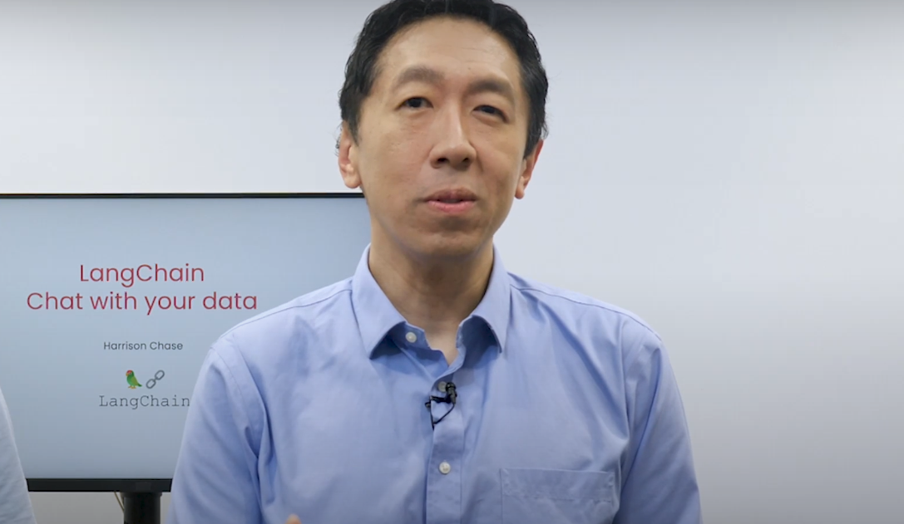

# LangChain: Chat with Your Data


[Curso](https://www.deeplearning.ai/short-courses/chatgpt-prompt-engineering-for-developers/)


## Lo que aprenderás en este curso

Únete a nuestro nuevo curso corto, ¡LangChain: Chatea con tus datos! El curso aborda dos temas principales: (1) Generación Aumentada por Recuperación (RAG), una aplicación común de LLM que recupera documentos contextuales de un conjunto de datos externo, y (2) una guía para construir un chatbot que responda a consultas basadas en el contenido de tus documentos, en lugar de la información que ha aprendido en el entrenamiento.

### Aprenderás sobre:

- **Carga de Documentos**: Aprende los fundamentos de la carga de datos y descubre más de 80 cargadores únicos que LangChain proporciona para acceder a diversas fuentes de datos, incluyendo audio y video.
- **División de Documentos**: Descubre las mejores prácticas y consideraciones para dividir datos.
- **Almacenes de Vectores y Embeddings**: Sumérgete en el concepto de embeddings y explora las integraciones de almacenes de vectores dentro de LangChain.
- **Recuperación**: Comprende técnicas avanzadas para acceder e indexar datos en el almacén de vectores, permitiéndote recuperar la información más relevante más allá de las consultas semánticas.
- **Responder Preguntas**: Construye una solución de respuesta a preguntas en una sola pasada.
- **Chat**: Aprende cómo rastrear y seleccionar información pertinente de conversaciones y fuentes de datos, mientras construyes tu propio chatbot usando LangChain.

Empieza a construir aplicaciones prácticas que te permitan interactuar con datos usando LangChain y LLMs.

### ¿Quién debería unirse?

Desarrolladores familiarizados con Python que estén interesados en desarrollar aplicaciones utilizando Modelos de Lenguaje de Gran Escala como ChatGPT.

# Índice

- [Introduction](#introduction)
- [Document Loading](#document-loading)
- [Document Splitting](#document-splitting)
- [Vectorstores and Embedding](#vectorstores-and-embedding)
- [Retrieval](#retrieval)
- [Question Answering](#question-answering)
- [Chat](#chat)
- [Conclusion](#conclusion)

# Introduction
[Volver al índice](#índice)



En este curso, aprenderás cómo usar LangChain para chatear con tus datos. Este curso se ha creado en colaboración con Harrison Chase, cofundador y CEO de LangChain.

Los modelos de lenguaje de gran escala (LLMs), como ChatGPT, pueden responder preguntas sobre muchos temas. Sin embargo, 
un LLM en aislamiento solo sabe lo que se le ha enseñado durante su entrenamiento, lo que no incluye tus datos personales, 
documentos propietarios de tu empresa, ni datos o artículos escritos después de su entrenamiento. 

Sería útil que tú o tus clientes pudieran tener una conversación con tus propios documentos y obtener respuestas a preguntas 
utilizando información de esos documentos y un LLM. En este curso corto, cubriremos cómo usar LangChain para chatear con 
tus datos. 


LangChain es un marco de desarrollo de código abierto para construir aplicaciones de LLM. LangChain consta de varios 
componentes modulares, así como de plantillas más integrales. Los componentes modulares incluyen prompts, modelos, índices, 
cadenas y agentes.


En este curso, nos enfocaremos en uno de los casos de uso más populares de LangChain: cómo usar LangChain para chatear con 
tus datos. Primero, cubriremos cómo usar los cargadores de documentos de LangChain para cargar datos de una variedad de fuentes. 
Luego, tocaremos cómo dividir estos documentos en partes semánticamente significativas. Este paso de preprocesamiento 
puede parecer simple, pero tiene mucha complejidad.


A continuación, daremos una visión general de la búsqueda semántica, un método básico para obtener información relevante a 
partir de una pregunta del usuario. Este es el método más fácil para comenzar, pero hay varios casos donde falla. 
Revisaremos estos casos y cómo solucionarlos. Luego, mostraremos cómo usar los documentos recuperados para permitir que un 
LLM responda preguntas sobre un documento, pero aún falta una pieza clave para recrear completamente la experiencia de un chatbot.

Finalmente, cubriremos esa pieza faltante, la memoria, y mostraremos cómo construir un chatbot completamente funcional con 
el cual puedas chatear con tus datos.


Este será un curso corto emocionante. Estamos agradecidos con Ankush Gola y Lance Martin del equipo de LangChain por 
trabajar en todos los materiales que escucharás a Harrison presentar más adelante, así como a Geoff Ladwig y Diala Ezzeddine 
del equipo de deeplearning.ai.

En caso de que necesites un repaso sobre los conceptos básicos de LangChain, te animamos a tomar el curso corto anterior sobre 
el desarrollo de aplicaciones con LLM que mencionó Harrison. Ahora, pasemos al siguiente video donde Harrison te mostrará 
cómo usar la conveniente colección de cargadores de documentos de LangChain.


# Document Loading
[Volver al índice](#índice)

> Notebook: [01_document_loading.ipynb](notebooks/01_document_loading.ipynb)

## Nota para los estudiantes
Durante períodos de alta carga, es posible que el cuaderno no responda. Puede parecer que ejecuta una celda, actualizar el número de finalización entre corchetes [#] a la izquierda de la celda, pero es posible que la celda no se haya ejecutado. Esto es particularmente obvio en las declaraciones de impresión cuando no hay salida. Si esto sucede, reinicie el kernel utilizando el comando en la pestaña Kernel.

## Generación aumentada por recuperación
 
En la generación aumentada por recuperación (RAG), un LLM recupera documentos contextuales de un conjunto de datos externo como parte de su ejecución. 

Esto es útil si queremos hacer preguntas sobre documentos específicos (por ejemplo, nuestros archivos PDF, un conjunto de videos, etc.). 


```python
#! pip install langchain
```


```python
import os
import openai
import sys
sys.path.append('../..')

from dotenv import load_dotenv, find_dotenv
_ = load_dotenv(find_dotenv()) # read local .env file

openai.api_key = os.environ['OPENAI_API_KEY']
```

## PDFs

¡Cargue un PDF [transcripción](https://see.stanford.edu/materials/aimlcs229/transcripts/MachineLearning-Lecture01.pdf) del famoso curso CS229 de Andrew Ng! Estos documentos son el resultado de la transcripción automatizada, por lo que las palabras y las oraciones a veces se dividen inesperadamente.


```python
# El curso mostrará las instalaciones de pip que necesitarías para instalar paquetes en tu propia máquina.
# Estos paquetes ya están instalados en esta plataforma y no deben ejecutarse de nuevo.
#! pip install pypdf 
```


```python
from langchain.document_loaders import PyPDFLoader
loader = PyPDFLoader("docs/cs229_lectures/MachineLearning-Lecture01.pdf")
pages = loader.load()
```

Cada página es un `Document`.

Un `Document` contiene texto (`page_content`) y `metadata`.


```python
len(pages)
```


  22


```python
page = pages[0]
```


```python
print(page.page_content[0:500])
```

  MachineLearning-Lecture01  
  Instructor (Andrew Ng): Okay. Good morning. Welcome to CS229, the machine 
  learning class. So what I wanna do today is ju st spend a little time going over the logistics 
  of the class, and then we'll start to talk a bit about machine learning.  
  By way of introduction, my name's Andrew Ng and I'll be instru ctor for this class. And so 
  I personally work in machine learning, and I' ve worked on it for about 15 years now, and 
  I actually think that machine learning i


```python
page.metadata
```


  {'source': 'docs/cs229_lectures/MachineLearning-Lecture01.pdf', 'page': 0}


## YouTube


```python
from langchain.document_loaders.generic import GenericLoader
from langchain.document_loaders.parsers import OpenAIWhisperParser
from langchain.document_loaders.blob_loaders.youtube_audio import YoutubeAudioLoader
```


```python
# ! pip install yt_dlp
# ! pip install pydub
```

**Nota**: Esto puede tardar varios minutos en completarse.


```python
url="https://www.youtube.com/watch?v=jGwO_UgTS7I"
save_dir="docs/youtube/"
loader = GenericLoader(
  YoutubeAudioLoader([url],save_dir),
  OpenAIWhisperParser()
)
docs = loader.load()
```

  [youtube] Extracting URL: https://www.youtube.com/watch?v=jGwO_UgTS7I
  [youtube] jGwO_UgTS7I: Downloading webpage
  [youtube] jGwO_UgTS7I: Downloading ios player API JSON
  [youtube] jGwO_UgTS7I: Downloading android player API JSON


  WARNING: [youtube] YouTube said: ERROR - Precondition check failed.
  WARNING: [youtube] HTTP Error 400: Bad Request. Retrying (1/3)...


  [youtube] jGwO_UgTS7I: Downloading android player API JSON


  WARNING: [youtube] YouTube said: ERROR - Precondition check failed.
  WARNING: [youtube] HTTP Error 400: Bad Request. Retrying (2/3)...


  [youtube] jGwO_UgTS7I: Downloading android player API JSON


  WARNING: [youtube] YouTube said: ERROR - Precondition check failed.
  WARNING: [youtube] HTTP Error 400: Bad Request. Retrying (3/3)...


  [youtube] jGwO_UgTS7I: Downloading android player API JSON


  WARNING: [youtube] YouTube said: ERROR - Precondition check failed.
  WARNING: [youtube] Unable to download API page: HTTP Error 400: Bad Request (caused by <HTTPError 400: 'Bad Request'>); please report this issue on https://github.com/yt-dlp/yt-dlp/issues?q= , filling out the appropriate issue template. Confirm you are on the latest version using yt-dlp -U


  [youtube] jGwO_UgTS7I: Downloading player 84314bef
  [youtube] jGwO_UgTS7I: Downloading m3u8 information
  [info] jGwO_UgTS7I: Downloading 1 format(s): 140
  [download] Destination: docs/youtube//Stanford CS229： Machine Learning Course, Lecture 1 - Andrew Ng (Autumn 2018).m4a
  [download] 100% of  69.76MiB in 00:00:01 at 43.17MiB/s   
  [FixupM4a] Correcting container of "docs/youtube//Stanford CS229： Machine Learning Course, Lecture 1 - Andrew Ng (Autumn 2018).m4a"
  [ExtractAudio] Not converting audio docs/youtube//Stanford CS229： Machine Learning Course, Lecture 1 - Andrew Ng (Autumn 2018).m4a; file is already in target format m4a
  Transcribing part 1!
  Transcribing part 2!
  Transcribing part 3!


  ---------------------------------------------------------------------------

  APIError                 Traceback (most recent call last)

  Cell In[11], line 7
     2 save_dir="docs/youtube/"
     3 loader = GenericLoader(
     4   YoutubeAudioLoader([url],save_dir),
     5   OpenAIWhisperParser()
     6 )
  ----> 7 docs = loader.load()


  File /usr/local/lib/python3.9/site-packages/langchain/document_loaders/generic.py:90, in GenericLoader.load(self)
     88 def load(self) -> List[Document]:
     89   """Load all documents."""
  ---> 90   return list(self.lazy_load())


  File /usr/local/lib/python3.9/site-packages/langchain/document_loaders/generic.py:86, in GenericLoader.lazy_load(self)
     84 """Load documents lazily. Use this when working at a large scale."""
     85 for blob in self.blob_loader.yield_blobs():
  ---> 86   yield from self.blob_parser.lazy_parse(blob)


  File /usr/local/lib/python3.9/site-packages/langchain/document_loaders/parsers/audio.py:51, in OpenAIWhisperParser.lazy_parse(self, blob)
     49 # Transcribe
     50 print(f"Transcribing part {split_number+1}!")
  ---> 51 transcript = openai.Audio.transcribe("whisper-1", file_obj)
     53 yield Document(
     54   page_content=transcript.text,
     55   metadata={"source": blob.source, "chunk": split_number},
     56 )


  File /usr/local/lib/python3.9/site-packages/openai/api_resources/audio.py:57, in Audio.transcribe(cls, model, file, api_key, api_base, api_type, api_version, organization, **params)
     55 requestor, files, data = cls._prepare_request(file, file.name, model, **params)
     56 url = cls._get_url("transcriptions")
  ---> 57 response, _, api_key = requestor.request("post", url, files=files, params=data)
     58 return util.convert_to_openai_object(
     59   response, api_key, api_version, organization
     60 )


  File /usr/local/lib/python3.9/site-packages/openai/api_requestor.py:226, in APIRequestor.request(self, method, url, params, headers, files, stream, request_id, request_timeout)
    205 def request(
    206   self,
    207   method,
    (...)
    214   request_timeout: Optional[Union[float, Tuple[float, float]]] = None,
    215 ) -> Tuple[Union[OpenAIResponse, Iterator[OpenAIResponse]], bool, str]:
    216   result = self.request_raw(
    217     method.lower(),
    218     url,
    (...)
    224     request_timeout=request_timeout,
    225   )
  --> 226   resp, got_stream = self._interpret_response(result, stream)
    227   return resp, got_stream, self.api_key


  File /usr/local/lib/python3.9/site-packages/openai/api_requestor.py:619, in APIRequestor._interpret_response(self, result, stream)
    611   return (
    612     self._interpret_response_line(
    613       line, result.status_code, result.headers, stream=True
    614     )
    615     for line in parse_stream(result.iter_lines())
    616   ), True
    617 else:
    618   return (
  --> 619     self._interpret_response_line(
    620       result.content.decode("utf-8"),
    621       result.status_code,
    622       result.headers,
    623       stream=False,
    624     ),
    625     False,
    626   )


  File /usr/local/lib/python3.9/site-packages/openai/api_requestor.py:679, in APIRequestor._interpret_response_line(self, rbody, rcode, rheaders, stream)
    677 stream_error = stream and "error" in resp.data
    678 if stream_error or not 200 <= rcode < 300:
  --> 679   raise self.handle_error_response(
    680     rbody, rcode, resp.data, rheaders, stream_error=stream_error
    681   )
    682 return resp


  APIError: Timed out generating response. Please try again with a shorter prompt or with `max_tokens` set to a lower value. {
    "error": {
      "message": "Timed out generating response. Please try again with a shorter prompt or with `max_tokens` set to a lower value.",
      "type": "internal_error",
      "param": null,
      "code": "request_timeout"
    }
  }
   500 {'error': {'message': 'Timed out generating response. Please try again with a shorter prompt or with `max_tokens` set to a lower value.', 'type': 'internal_error', 'param': None, 'code': 'request_timeout'}} {'Date': 'Fri, 21 Jun 2024 18:44:57 GMT', 'Content-Type': 'application/json; charset=utf-8', 'Content-Length': '251', 'Connection': 'keep-alive', 'Server': 'gunicorn', 'Vary': 'Origin, Accept-Language', 'x-ratelimit-limit-requests': '500', 'x-ratelimit-remaining-requests': '499', 'x-ratelimit-reset-requests': '120ms', 'x-request-id': '70d69874849557e931677576d6814532', 'strict-transport-security': 'max-age=31536000; includeSubDomains', 'CF-Cache-Status': 'DYNAMIC', 'CF-RAY': '89762445baf067a8-SJC', 'alt-svc': 'h3=":443"; ma=86400', 'X-Frame-Options': 'DENY', 'Content-Language': 'en', 'X-Content-Type-Options': 'nosniff', 'Referrer-Policy': 'same-origin', 'Cross-Origin-Opener-Policy': 'same-origin', 'Set-Cookie': '__cf_bm=2daQp4EN1ivqi8F.Vr5BZzSCJ9eF0Dqdconb_i3zWuk-1718995497-1.0.1.1-scNVVsHevzKcB_MN63kezvwqN_7be7Ml3Re6x2n2fLtQNIVSsLeBCVKJ522sBDPR27BATKAY9kKcXJwt_oRmXw; Domain=.api.openai.com; expires=Fri, 21-Jun-24 19:14:57 GMT; HttpOnly; Path=/; SameSite=None; Secure, _cfuvid=pdTJujNYyFQKkfaH4pANpobh0jvGJwNeMPIVOLdNWK8-1718995497693-0.0.1.1-604800000; Domain=.api.openai.com; HttpOnly; Path=/; SameSite=None; Secure'}


```python
docs[0].page_content[0:500]
```


  ---------------------------------------------------------------------------

  NameError                 Traceback (most recent call last)

  Cell In[12], line 1
  ----> 1 docs[0].page_content[0:500]


  NameError: name 'docs' is not defined


## URLs


```python
from langchain.document_loaders import WebBaseLoader

loader = WebBaseLoader("https://github.com/basecamp/handbook/blob/master/37signals-is-you.md")
```


```python
docs = loader.load()
```


```python
print(docs[0].page_content[:500])
```

## Notion

Sigue los pasos [aquí](https://python.langchain.com/docs/modules/data_connection/document_loaders/integrations/notion) para un ejemplo de sitio de Notion como [este](https://yolospace.notion.site/Blendle-s-Employee-Handbook-e31bff7da17346ee99f531087d8b133f):

* Duplica la página en tu propio espacio de Notion y exporta como `Markdown / CSV`.
* Descomprime el archivo y guárdalo como una carpeta que contenga el archivo markdown para la página de Notion.
 


```python
from langchain.document_loaders import NotionDirectoryLoader
loader = NotionDirectoryLoader("docs/Notion_DB")
docs = loader.load()
```


```python
print(docs[0].page_content[0:200])
```

  ## Manual de Empleados de Blendle
   
  Este es un documento vivo con todo lo que hemos aprendido trabajando con personas mientras dirigimos una startup. Y, por supuesto, seguimos aprendiendo. Por lo tanto, es un documento que


```python
docs[0].metadata
```


  {'source': "docs/Notion_DB/Blendle's Employee Handbook e367aa77e225482c849111687e114a56.md"}


# Document Splitting
[Volver al índice](#índice)

> Notebook: [02_document_splitting.ipynb](notebooks%2F02_document_splitting.ipynb)

```python
import os
import openai
import sys
sys.path.append('../..')

from dotenv import load_dotenv, find_dotenv
_ = load_dotenv(find_dotenv()) # read local .env file

openai.api_key = os.environ['OPENAI_API_KEY']
```

```python
from langchain.text_splitter import RecursiveCharacterTextSplitter, CharacterTextSplitter
```

```python
chunk_size =26
chunk_overlap = 4
```

```python
r_splitter = RecursiveCharacterTextSplitter(
  chunk_size=chunk_size,
  chunk_overlap=chunk_overlap
)
c_splitter = CharacterTextSplitter(
  chunk_size=chunk_size,
  chunk_overlap=chunk_overlap
)
```

¿Por qué esto no divide la cadena de abajo?

```python
text1 = 'abcdefghijklmnopqrstuvwxyz'
```
básicamente por que le pusimos que dividierá después de 26 letras
```python
r_splitter.split_text(text1)
```

  ['abcdefghijklmnopqrstuvwxyz']

```python
text2 = 'abcdefghijklmnopqrstuvwxyzabcdefg'
```

```python
r_splitter.split_text(text2)
```

  ['abcdefghijklmnopqrstuvwxyz', 'wxyzabcdefg']

Ok, esto divide la cadena pero tenemos un solape especificado como 5, pero parece ser 3? (intenta con un número par)

```python
text3 = "a b c d e f g h i j k l m n o p q r s t u v w x y z"
```

```python
r_splitter.split_text(text3)
```

  ['a b c d e f g h i j k l m', 'l m n o p q r s t u v w x', 'w x y z']

```python
c_splitter.split_text(text3)
```

  ['a b c d e f g h i j k l m n o p q r s t u v w x y z']

```python
c_splitter = CharacterTextSplitter(
  chunk_size=chunk_size,
  chunk_overlap=chunk_overlap,
  separator = ' '
)
c_splitter.split_text(text3)
```

  ['a b c d e f g h i j k l m', 'l m n o p q r s t u v w x', 'w x y z']

¡Prueba tus propios ejemplos!

## Detalles de división recursiva

`RecursiveCharacterTextSplitter` es recomendado para texto genérico. 

```python
some_text = """When writing documents, writers will use document structure to group content. \
This can convey to the reader, which idea's are related. For example, closely related ideas \
are in sentances. Similar ideas are in paragraphs. Paragraphs form a document. \n\n \
Paragraphs are often delimited with a carriage return or two carriage returns. \
Carriage returns are the "backslash n" you see embedded in this string. \
Sentences have a period at the end, but also, have a space.\
and words are separated by space."""
```

```python
len(some_text)
```

  496

```python
c_splitter = CharacterTextSplitter(
  chunk_size=450,
  chunk_overlap=0,
  separator = ' '
)
r_splitter = RecursiveCharacterTextSplitter(
  chunk_size=450,
  chunk_overlap=0, 
  separators=["\n\n", "\n", " ", ""]
)
```

```python
c_splitter.split_text(some_text)
```

  ['When writing documents, writers will use document structure to group content. This can convey to the reader, which idea\'s are related. For example, closely related ideas are in sentances. Similar ideas are in paragraphs. Paragraphs form a document. \n\n Paragraphs are often delimited with a carriage return or two carriage returns. Carriage returns are the "backslash n" you see embedded in this string. Sentences have a period at the end, but also,',
   'have a space.and words are separated by space.']

```python
r_splitter.split_text(some_text)
```

  ["When writing documents, writers will use document structure to group content. This can convey to the reader, which idea's are related. For example, closely related ideas are in sentances. Similar ideas are in paragraphs. Paragraphs form a document.",
   'Paragraphs are often delimited with a carriage return or two carriage returns. Carriage returns are the "backslash n" you see embedded in this string. Sentences have a period at the end, but also, have a space.and words are separated by space.']

Reduciremos el tamaño del trozo un poco y añadiremos un punto a nuestros separadores:

```python
r_splitter = RecursiveCharacterTextSplitter(
  chunk_size=150,
  chunk_overlap=0,
  separators=["\n\n", "\n", "\. ", " ", ""]
)
r_splitter.split_text(some_text)
```

  ["When writing documents, writers will use document structure to group content. This can convey to the reader, which idea's are related",
   '. For example, closely related ideas are in sentances. Similar ideas are in paragraphs. Paragraphs form a document.',
   'Paragraphs are often delimited with a carriage return or two carriage returns',
   '. Carriage returns are the "backslash n" you see embedded in this string',
   '. Sentences have a period at the end, but also, have a space.and words are separated by space.']

```python
r_splitter = RecursiveCharacterTextSplitter(
  chunk_size=150,
  chunk_overlap=0,
  separators=["\n\n", "\n", "(?<=\. )", " ", ""]
)
r_splitter.split_text(some_text)
```

  ["When writing documents, writers will use document structure to group content. This can convey to the reader, which idea's are related.",
   'For example, closely related ideas are in sentances. Similar ideas are in paragraphs. Paragraphs form a document.',
   'Paragraphs are often delimited with a carriage return or two carriage returns.',
   'Carriage returns are the "backslash n" you see embedded in this string.',
   'Sentences have a period at the end, but also, have a space.and words are separated by space.']

```python
from langchain.document_loaders import PyPDFLoader
loader = PyPDFLoader("docs/cs229_lectures/MachineLearning-Lecture01.pdf")
pages = loader.load()
```

```python
from langchain.text_splitter import CharacterTextSplitter
text_splitter = CharacterTextSplitter(
  separator="\n",
  chunk_size=1000,
  chunk_overlap=150,
  length_function=len
)
```

```python
docs = text_splitter.split_documents(pages)
```

```python
len(docs)
```

  77

```python
len(pages)
```

  22

```python
from langchain.document_loaders import NotionDirectoryLoader
loader = NotionDirectoryLoader("docs/Notion_DB")
notion_db = loader.load()
```

```python
docs = text_splitter.split_documents(notion_db)
```

```python
len(notion_db)
```

  52

```python
len(docs)
```

  353

## División de tokens

También podemos dividir explícitamente por conteo de tokens, si queremos.

Esto puede ser útil porque los LLM a menudo tienen ventanas de contexto designadas en tokens.

Los tokens a menudo son ~4 caracteres.

```python
from langchain.text_splitter import TokenTextSplitter
```

```python
text_splitter = TokenTextSplitter(chunk_size=1, chunk_overlap=0)
```

```python
text1 = "foo bar bazzyfoo"
```

```python
text_splitter.split_text(text1)
```

  ['foo', ' bar', ' b', 'az', 'zy', 'foo']

```python
text_splitter = TokenTextSplitter(chunk_size=10, chunk_overlap=0)
```

```python
docs = text_splitter.split_documents(pages)
```

```python
docs[0]
```

  Document(page_content='MachineLearning-Lecture01 \n', metadata={'source': 'docs/cs229_lectures/MachineLearning-Lecture01.pdf', 'page': 0})

```python
pages[0].metadata
```

  {'source': 'docs/cs229_lectures/MachineLearning-Lecture01.pdf', 'page': 0}

## División consciente del contexto

El troceado tiene como objetivo mantener el texto con contexto común junto.

Una división de texto a menudo utiliza oraciones u otros delimitadores para mantener el texto relacionado junto, pero muchos documentos (como Markdown) tienen estructura (encabezados) que se pueden utilizar explícitamente en la división.

Podemos usar `MarkdownHeaderTextSplitter` para preservar los metadatos del encabezado en nuestros trozos, como se muestra a continuación.

```python
from langchain.document_loaders import NotionDirectoryLoader
from langchain.text_splitter import MarkdownHeaderTextSplitter
```

```python
markdown_document = """# Title\n\n \
## Chapter 1\n\n \
Hi this is Jim\n\n Hi this is Joe\n\n \
### Section \n\n \
Hi this is Lance \n\n 
## Chapter 2\n\n \
Hi this is Molly"""
```

```python
headers_to_split_on = [
  ("#", "Header 1"),
  ("##", "Header 2"),
  ("###", "Header 3"),
]
```

```python
markdown_splitter = MarkdownHeaderTextSplitter(
  headers_to_split_on=headers_to_split_on
)
md_header_splits = markdown_splitter.split_text(markdown_document)
```

```python
md_header_splits[0]
```

  Document(page_content='Hi this is Jim \nHi this is Joe', metadata={'Header 1': 'Title', 'Header 2': 'Chapter 1'})

```python
md_header_splits[1]
```

  Document(page_content='Hi this is Lance', metadata={'Header 1': 'Title', 'Header 2': 'Chapter 1', 'Header 3': 'Section'})

Prueba con un archivo Markdown real, como una base de datos de Notion.

```python
loader = NotionDirectoryLoader("docs/Notion_DB")
docs = loader.load()
txt = ' '.join([d.page_content for d in docs])
```

```python
headers_to_split_on = [
  ("#", "Header 1"),
  ("##", "Header 2"),
]
markdown_splitter = MarkdownHeaderTextSplitter(
  headers_to_split_on=headers_to_split_on
)
```

```python
md_header_splits = markdown_splitter.split_text(txt)
```

```python
md_header_splits[0]
```

  Document(page_content="This is a living document with everything we've learned working with people while running a startup. And, of course, we continue to learn. Therefore it's a document that will continue to change. \n**Everything related to working at Blendle and the people of Blendle, made public.** \nThese are the lessons from three years of working with the people of Blendle. It contains everything from [how our leaders lead](https://www.notion.so/ecfb7e647136468a9a0a32f1771a8f52?pvs=21) to [how we increase salaries](https://www.notion.so/Salary-Review-e11b6161c6d34f5c9568bb3e83ed96b6?pvs=21), from [how we hire](https://www.notion.so/Hiring-451bbcfe8d9b49438c0633326bb7af0a?pvs=21) and [fire](https://www.notion.so/Firing-5567687a2000496b8412e53cd58eed9d?pvs=21) to [how we think people should give each other feedback](https://www.notion.so/Our-Feedback-Process-eb64f1de796b4350aeab3bc068e3801f?pvs=21) — and much more. \nWe've made this document public because we want to learn from you. We're very much interested in your feedback (including weeding out typo's and Dunglish ;)). Email us at hr@blendle.com. If you're starting your own company or if you're curious as to how we do things at Blendle, we hope that our employee handbook inspires you. \nIf you want to work at Blendle you can check our [job ads here](https://blendle.homerun.co/). If you want to be kept in the loop about Blendle, you can sign up for [our behind the scenes newsletter](https://blendle.homerun.co/yes-keep-me-posted/tr/apply?token=8092d4128c306003d97dd3821bad06f2).", metadata={'Header 1': "Blendle's Employee Handbook"})


# Vectorstores and Embedding
[Volver al índice](#índice)

> Notebook: [03_vectorstores_and_embeddings.ipynb](notebooks%2F03_vectorstores_and_embeddings.ipynb)
> 

Recuerde el flujo de trabajo general para la generación aumentada por recuperación (RAG):


```python
import os
import openai
import sys
sys.path.append('../..')

from dotenv import load_dotenv, find_dotenv
_ = load_dotenv(find_dotenv())  # leer archivo .env local

openai.api_key = os.environ['OPENAI_API_KEY']
```

Acabamos de discutir `Carga de Documentos` y `División`.

```python
from langchain.document_loaders import PyPDFLoader

# Cargar PDF
loaders = [
    # Documentos duplicados a propósito - datos desordenados
    PyPDFLoader("docs/cs229_lectures/MachineLearning-Lecture01.pdf"),
    PyPDFLoader("docs/cs229_lectures/MachineLearning-Lecture01.pdf"),
    PyPDFLoader("docs/cs229_lectures/MachineLearning-Lecture02.pdf"),
    PyPDFLoader("docs/cs229_lectures/MachineLearning-Lecture03.pdf")
]
docs = []
for loader in loaders:
    docs.extend(loader.load())
```

```python
# Dividir
from langchain.text_splitter import RecursiveCharacterTextSplitter
text_splitter = RecursiveCharacterTextSplitter(
    chunk_size = 1500,
    chunk_overlap = 150
)
```

```python
splits = text_splitter.split_documents(docs)
```

```python
len(splits)
```

```python
    209
```

## Embeddings

Vamos a tomar nuestras divisiones y embebidas.

```python
from langchain.embeddings.openai import OpenAIEmbeddings
embedding = OpenAIEmbeddings()
```

```python
sentence1 = "i like dogs"
sentence2 = "i like canines"
sentence3 = "the weather is ugly outside"
```

```python
embedding1 = embedding.embed_query(sentence1)
embedding2 = embedding.embed_query(sentence2)
embedding3 = embedding.embed_query(sentence3)
```

```python
import numpy as np
```

```python
np.dot(embedding1, embedding2)
```

```python
    0.9630351468341317
```

```python
np.dot(embedding1, embedding3)
```

```python
    0.7701147942700532
```

```python
np.dot(embedding2, embedding3)
```

```python
    0.7591130371091993
```

## Almacenes de Vectores

```python
# ! pip install chromadb
```

```python
from langchain.vectorstores import Chroma
```

```python
persist_directory = 'docs/chroma/'
```

```python
!rm -rf ./docs/chroma  # eliminar archivos de base de datos antiguos si existen
```

```python
vectordb = Chroma.from_documents(
    documents=splits,
    embedding=embedding,
    persist_directory=persist_directory
)
```

```python
print(vectordb._collection.count())
```

    209

### Búsqueda de Similitud

```python
question = "is there an email i can ask for help"
```

```python
docs = vectordb.similarity_search(question, k=3)
```

```python
len(docs)
```

    3

```python
docs[0].page_content
```

    "cs229-qa@cs.stanford.edu. This goes to an account that's read by all the TAs and me. So rather than sending us email individually, if you send email to this account, it will actually let us get back to you maximally quickly with answers to your questions. If you're asking questions about homework problems, please say in the subject line which assignment and which question the email refers to, since that will also help us to route your question to the appropriate TA or to me appropriately and get the response back to you quickly. Let's see. Skipping ahead — let's see — for homework, one midterm, one open and term project. Notice on the honor code. So one thing that I think will help you to succeed and do well in this class and even help you to enjoy this class more is if you form a study group. So start looking around where you're sitting now or at the end of class today, mingle a little bit and get to know your classmates. I strongly encourage you to form study groups and sort of have a group of people to study with and have a group of your fellow students to talk over these concepts with. You can also post on the class news group if you want to use that to try to form a study group. But some of the problems sets in this class are reasonably difficult. People that have taken the class before may tell you they were very difficult. And just I bet it would be more fun for you, and you'd probably have a better learning experience if you form a"

Vamos a guardar esto para poder usarlo más tarde!

```python
vectordb.persist()
```

## Modos de Fallo

Esto parece genial, y la búsqueda básica de similitud te llevará al 80% del camino muy fácilmente.

Pero hay algunos modos de fallo que pueden surgir.

Aquí hay algunos casos límite que pueden surgir - los arreglaremos en la próxima clase.

```python
question = "what did they say about matlab?"
```

```python
docs = vectordb.similarity_search(question, k=5)
```

Note que estamos obteniendo fragmentos duplicados (debido al duplicado `MachineLearning-Lecture01.pdf` en el índice).

La búsqueda semántica recupera todos los documentos similares, pero no impone diversidad.

`docs[0]` y `docs[1]` son idénticos.

```python
docs[0]
```

    Document(page_content='those homeworks will be done in either MATLAB or in Octave, which is sort of — I know some people call it a free version of MATLAB, which it sort of is, sort of isn't. So I guess for those of you that haven't seen MATLAB before, and I know most of you have, MATLAB is I guess part of the programming language that makes it very easy to write codes using matrices, to write code for numerical routines, to move data around, to plot data. And it's sort of an extremely easy to learn tool to use for implementing a lot of learning algorithms. And in case some of you want to work on your own home computer or something if you don't have a MATLAB license, for the purposes of this class, there's also — [inaudible] write that down [inaudible] MATLAB — there's also a software package called Octave that you can download for free off the Internet. And it has somewhat fewer features than MATLAB, but it's free, and for the purposes of this class, it will work for just about everything. So actually I, well, so yeah, just a side comment for those of you that haven't seen MATLAB before I guess, once a colleague of mine at a different university, not at Stanford, actually teaches another machine learning course. He's taught it for many years. So one day, he was in his office, and an old student of his from, like, ten years ago came into his office and he said, "Oh, professor, professor, thank you so much for your', metadata={'source': 'docs/cs229_lectures/MachineLearning-Lecture01.pdf', 'page': 8})

```python
docs[1]
```

    Document(page_content='those homeworks will be done in either MATLAB or in Octave, which is sort of — I know some people call it a free version of MATLAB, which it sort of is, sort of isn't. So I guess for those of you that haven't seen MATLAB before, and I know most of you have, MATLAB is I guess part of the programming language that makes it very easy to write codes using matrices, to write code for numerical routines, to move data around, to plot data. And it's sort of an extremely easy to learn tool to use for implementing a lot of learning algorithms. And in case some of you want to work on your own home computer or something if you don't have a MATLAB license, for the purposes of this class, there's also — [inaudible] write that down [inaudible] MATLAB — there's also a software package called Octave that you can download for free off the Internet. And it has somewhat fewer features than MATLAB, but it's free, and for the purposes of this class, it will work for just about everything. So actually I, well, so yeah, just a side comment for those of you that haven't seen MATLAB before I guess, once a colleague of mine at a different university, not at Stanford, actually teaches another machine learning course. He's taught it for many years. So one day, he was in his office, and an old student of his from, like, ten years ago came into his office and he said, "Oh, professor, professor, thank you so much for your', metadata={'source': 'docs/cs229_lectures/MachineLearning-Lecture01.pdf', 'page': 8})

Podemos ver un nuevo modo de fallo.

La pregunta a continuación pregunta sobre la tercera conferencia, pero incluye resultados de otras conferencias también.

```python
question = "what did they say about regression in the third lecture?"
```

```python
docs = vectordb.similarity_search(question, k=5)
```

```python
for doc in docs:
    print(doc.metadata)
```

    {'source': 'docs/cs229_lectures/MachineLearning-Lecture03.pdf', 'page': 0}
    {'source': 'docs/cs229_lectures/MachineLearning-Lecture03.pdf', 'page': 14}
    {'source': 'docs/cs229_lectures/MachineLearning-Lecture02.pdf', 'page': 0}
    {'source': 'docs/cs229_lectures/MachineLearning-Lecture03.pdf', 'page': 6}
    {'source': 'docs/cs229_lectures/MachineLearning-Lecture01.pdf', 'page': 8}

```python
print(docs[4].page_content)
```

    into his office and he said, "Oh, professor, professor, thank you so much for your machine learning class. I learned so much from it. There's this stuff that I learned in your class, and I now use every day. And it's helped me make lots of money, and here's a picture of my big house." So my friend was very excited. He said, "Wow. That's great. I'm glad to hear this machine learning stuff was actually useful. So what was it that you learned? Was it logistic regression? Was it the PCA? Was it the data networks? What was it that you learned that was so helpful?" And the student said, "Oh, it was the MATLAB." So for those of you that don't know MATLAB yet, I hope you do learn it. It's not hard, and we'll actually have a short MATLAB tutorial in one of the discussion sections for those of you that don't know it. Okay. The very last piece of logistical thing is the discussion sections. So discussion sections will be taught by the TAs, and attendance at discussion sections is optional, although they'll also be recorded and televised. And we'll use the discussion sections mainly for two things. For the next two or three weeks, we'll use the discussion sections to go over the prerequisites to this class or if some of you haven't seen probability or statistics for a while or maybe algebra, we'll go over those in the discussion sections as a refresher for those of you that want one.

Los enfoques discutidos en la próxima conferencia pueden ser utilizados para abordar ambos temas!


# Retrieval
[Volver al índice](#índice)

> Notebook: [04_retrieval.ipynb](notebooks%2F04_retrieval.ipynb)
> 

La recuperación es la pieza central de nuestro flujo de generación aumentada por recuperación (RAG).

Obtengamos nuestro vectorDB de antes.

## Recuperación de Vectorstore

### Búsqueda de similitud

```python
from langchain.vectorstores import Chroma
from langchain.embeddings.openai import OpenAIEmbeddings
persist_directory = 'docs/chroma/'
```

```python
embedding = OpenAIEmbeddings()
vectordb = Chroma(
  persist_directory=persist_directory,
  embedding_function=embedding
)
```

```python
print(vectordb._collection.count())
```

  209

```python
texts = [
  """El Amanita phalloides tiene un cuerpo fructífero (basidiocarpo) epigeo (sobre el suelo) grande e imponente.""",
  """Un hongo con un cuerpo fructífero grande es el Amanita phalloides. Algunas variedades son totalmente blancas.""",
  """A. phalloides, también conocido como el Hongo de la Muerte, es uno de los más venenosos de todos los hongos conocidos.""",
]
```

```python
smalldb = Chroma.from_texts(texts, embedding=embedding)
```

```python
question = "Dime sobre los hongos totalmente blancos con cuerpos fructíferos grandes"
```

```python
smalldb.similarity_search(question, k=2)
```

  [Document(page_content='Un hongo con un cuerpo fructífero grande es el Amanita phalloides. Algunas variedades son totalmente blancas.', metadata={}),
   Document(page_content='El Amanita phalloides tiene un cuerpo fructífero (basidiocarpo) epigeo (sobre el suelo) grande e imponente.', metadata={})]

```python
smalldb.max_marginal_relevance_search(question,k=2, fetch_k=3)
```

  [Document(page_content='Un hongo con un cuerpo fructífero grande es el Amanita phalloides. Algunas variedades son totalmente blancas.', metadata={}),
   Document(page_content='A. phalloides, también conocido como el Hongo de la Muerte, es uno de los más venenosos de todos los hongos conocidos.', metadata={})]

### Abordando la diversidad: Máxima relevancia marginal

En la clase pasada, introdujimos un problema: cómo hacer cumplir la diversidad en los resultados de la búsqueda.
 
La `Máxima Relevancia Marginal` se esfuerza por lograr tanto la relevancia a la consulta *como la diversidad* entre los resultados.

```python
question = "qué dijeron sobre matlab?"
docs_ss = vectordb.similarity_search(question,k=3)
```

```python
docs_ss[0].page_content[:100]
```

  'esos deberes se harán en MATLA B o en Octave, que es algo — Yo \nconozco a algunas personas '

```python
docs_ss[1].page_content[:100]
```

  'esos deberes se harán en MATLA B o en Octave, que es algo — Yo \nconozco a algunas personas '

Tenga en cuenta la diferencia en los resultados con `MMR`.

```python
docs_mmr = vectordb.max_marginal_relevance_search(question,k=3)
```

```python
docs_mmr[0].page_content[:100]
```

  'esos deberes se harán en MATLA B o en Octave, que es algo — Yo \nconozco a algunas personas '

```python
docs_mmr[1].page_content[:100]
```

  'algoritmo entonces? Entonces, ¿qué es diferente? ¿Por qué yo estaba haciendo todo ese ruido antes sobre \nmenos cuadra'

### Abordando la especificidad: trabajar con metadatos

En la última clase, demostramos que una pregunta sobre la tercera clase puede incluir resultados de otras clases también.

Para abordar esto, muchas vectorstores admiten operaciones en `metadatos`.

Los `metadatos` brindan contexto para cada fragmento incrustado.

```python
question = "¿qué dijeron sobre la regresión en la tercera clase?"
```

```python
docs = vectordb.similarity_search(
  question,
  k=3,
  filter={"source":"docs/cs229_lectures/MachineLearning-Lecture03.pdf"}
)
```

```python
for d in docs:
  print(d.metadata)
```

  {'source': 'docs/cs229_lectures/MachineLearning-Lecture03.pdf', 'page': 0}
  {'source': 'docs/cs229_lectures/MachineLearning-Lecture03.pdf', 'page': 14}
  {'source': 'docs/cs229_lectures/MachineLearning-Lecture03.pdf', 'page': 4}

### Abordando la especificidad: trabajar con metadatos usando el recuperador de autoconsulta

Pero tenemos un desafío interesante: a menudo queremos inferir los metadatos de la consulta misma.

Para abordar esto, podemos usar `SelfQueryRetriever`, que utiliza un LLM para extraer:
 
1. La cadena de `consulta` para usar en la búsqueda vectorial
2. Un filtro de metadatos para pasar también

La mayoría de las bases de datos vectoriales admiten filtros de metadatos, por lo que esto no requiere nuevas bases de datos o índices.

```python
from langchain.llms import OpenAI
from langchain.retrievers.self_query.base import SelfQueryRetriever
from langchain.chains.query_constructor.base import AttributeInfo
```

```python
metadata_field_info = [
  AttributeInfo(
    name="source",
    description="La clase de la que es el fragmento, debe ser una de `docs/cs229_lectures/MachineLearning-Lecture01.pdf`, `docs/cs229_lectures/MachineLearning-Lecture02.pdf`, o `docs/cs229_lectures/MachineLearning-Lecture03.pdf`",
    type="string",
  ),
  AttributeInfo(
    name="page",
    description="La página de la clase",
    type="integer",
  ),
]
```

**Nota:** El modelo predeterminado para `OpenAI` ("from langchain.llms import OpenAI") es `text-davinci-003`. Debido a la eliminación del modelo de OpenAI `text-davinci-003` el 4 de enero de 2024, utilizarás el modelo de reemplazo recomendado por OpenAI `gpt-3.5-turbo-instruct` en su lugar.

```python
document_content_description = "Notas de clase"
llm = OpenAI(model='gpt-3.5-turbo-instruct', temperature=0)
retriever = SelfQueryRetriever.from_llm(
  llm,
  vectordb,
  document_content_description,
  metadata_field_info,
  verbose=True
)
```

```python
question = "¿qué dijeron sobre la regresión en la tercera clase?"
```

**Recibirás una advertencia** sobre la deprecación de predict_and_parse la primera vez que ejecutes la siguiente línea. Esto se puede ignorar con seguridad.

```python
docs = retriever.get_relevant_documents(question)
```

  /usr/local/lib/python3.9/site-packages/langchain/chains/llm.py:275: UserWarning: El método predict_and_parse está en desuso, en su lugar, pase un analizador de salida directamente a LLMChain.
   warnings.warn(

  query='regresión' filter=Comparison(comparator=<Comparator.EQ: 'eq'>, attribute='source', value='docs/cs229_lectures/MachineLearning-Lecture03.pdf') limit=None

```python
for d in docs:
  print(d.metadata)
```

  {'source': 'docs/cs229_lectures/MachineLearning-Lecture03.pdf', 'page': 14}
  {'source': 'docs/cs229_lectures/MachineLearning-Lecture03.pdf', 'page': 0}
  {'source': 'docs/cs229_lectures/MachineLearning-Lecture03.pdf', 'page': 10}
  {'source': 'docs/cs229_lectures/MachineLearning-Lecture03.pdf', 'page': 10}

### Trucos adicionales: compresión

Otro enfoque para mejorar la calidad de los documentos recuperados es la compresión.

La información más relevante para una consulta puede estar enterrada en un documento con mucho texto irrelevante.

Pasar ese documento completo a través de su aplicación puede llevar a llamadas LLM más costosas y respuestas más deficientes.

La compresión contextual está destinada a solucionar esto.

```python
from langchain.retrievers import ContextualCompressionRetriever
from langchain.retrievers.document_compressors import LLMChainExtractor
```

```python
def pretty_print_docs(docs):
  print(f"\n{'-' * 100}\n".join([f"Documento {i+1}:\n\n" + d.page_content for i, d in enumerate(docs)]))

```

```python
# Envuelve nuestro vectorstore
llm = OpenAI(temperature=0, model="gpt-3.5-turbo-instruct")
compressor = LLMChainExtractor.from_llm(llm)
```

```python
compression_retriever = ContextualCompressionRetriever(
  base_compressor=compressor,
  base_retriever=vectordb.as_retriever()
)
```

```python
question = "¿qué dijeron sobre matlab?"
compressed_docs = compression_retriever.get_relevant_documents(question)
pretty_print_docs(compressed_docs)
```

  Documento 1:
   
  - "esos deberes se harán en MATLA B o en Octave"
  - "Sé que algunas personas lo llaman una versión gratuita de MATLAB"
  - "MATLAB es, supongo, parte del lenguaje de programación que hace que sea muy fácil escribir códigos usando matrices, escribir código para rutinas numéricas, mover datos, trazar datos".
  - "también hay un paquete de software llamado Octave que puedes descargar gratis de Internet".
  - "tiene algo menos de funciones que MATLAB, pero es gratis y, para los propósitos de esta clase, funcionará para casi todo".
  - "una vez, un colega mío en una universidad diferente, no en Stanford, en realidad enseña otro curso de aprendizaje automático".
  ----------------------------------------------------------------------------------------------------
  Documento 2:
   
  - "esos deberes se harán en MATLA B o en Octave"
  - "Sé que algunas personas lo llaman una versión gratuita de MATLAB"
  - "MATLAB es, supongo, parte del lenguaje de programación que hace que sea muy fácil escribir códigos usando matrices, escribir código para rutinas numéricas, mover datos, trazar datos".
  - "también hay un paquete de software llamado Octave que puedes descargar gratis de Internet".
  - "tiene algo menos de funciones que MATLAB, pero es gratis y, para los propósitos de esta clase, funcionará para casi todo".
  - "una vez, un colega mío en una universidad diferente, no en Stanford, en realidad enseña otro curso de aprendizaje automático".
  ----------------------------------------------------------------------------------------------------
  Documento 3:
   
  "Oh, era el MATLAB".
  ----------------------------------------------------------------------------------------------------
  Documento 4:
   
  "Oh, era el MATLAB".

## Combinando varias técnicas

```python
compression_retriever = ContextualCompressionRetriever(
  base_compressor=compressor,
  base_retriever=vectordb.as_retriever(search_type = "mmr")
)
```

```python
question = "¿qué dijeron sobre matlab?"
compressed_docs = compression_retriever.get_relevant_documents(question)
pretty_print_docs(compressed_docs)
```

  Documento 1:
   
  - "esos deberes se harán en MATLA B o en Octave"
  - "Sé que algunas personas lo llaman una versión gratuita de MATLAB"
  - "MATLAB es, supongo, parte del lenguaje de programación que hace que sea muy fácil escribir códigos usando matrices, escribir código para rutinas numéricas, mover datos, trazar datos".
  - "también hay un paquete de software llamado Octave que puedes descargar gratis de Internet".
  - "tiene algo menos de funciones que MATLAB, pero es gratis y, para los propósitos de esta clase, funcionará para casi todo".
  - "una vez, un colega mío en una universidad diferente, no en Stanford, en realidad enseña otro curso de aprendizaje automático".
  ----------------------------------------------------------------------------------------------------
  Documento 2:
   
  "Oh, era el MATLAB".
  ----------------------------------------------------------------------------------------------------
  Documento 3:
   
  - algoritmos de aprendizaje para enseñar a un automóvil cómo conducir a velocidades razonablemente altas fuera de la carretera evitando obstáculos.
  - ese es un robot programado por el estudiante de doctorado Eva Roshen para enseñarle a un robot algo extraño cómo subirse a un obstáculo, cómo superar un obstáculo.
  - Entonces creo que todos estos son robots para los que creo que es muy difícil codificar a mano un controlador mediante el aprendizaje de estos tipos de algoritmos de aprendizaje.
  - Solo un par de cosas más, pero déjame ver qué preguntas tienes ahora.
  - Entonces, si no hay preguntas, simplemente cerraré con dos recordatorios, que son después de clase hoy o cuando empieces a hablar con otras personas en esta clase, solo te animo de nuevo a que empieces a formar parejas de proyecto, a intentar encontrar parejas de proyecto para hacer tu proyecto con.
  - Y también, este es un buen momento para empezar a formar grupos de estudio, así que habla con tus amigos o publica en el grupo de noticias, pero solo te animamos a que intentes empezar a hacer ambas cosas hoy, ¿de acuerdo? Forma grupos de estudio e intenta encontrar dos parejas de proyecto más.

## Otros tipos de recuperación

Cabe destacar que vectordb no es el único tipo de herramienta para recuperar documentos.

La abstracción de recuperador de `LangChain` incluye otras formas de recuperar documentos, como TF-IDF o SVM.

```python
from langchain.retrievers import SVMRetriever
from langchain.retrievers import TFIDFRetriever
from langchain.document_loaders import PyPDFLoader
from langchain.text_splitter import RecursiveCharacterTextSplitter
```

```python
# Cargar PDF
loader = PyPDFLoader("docs/cs229_lectures/MachineLearning-Lecture01.pdf")
pages = loader.load()
all_page_text=[p.page_content for p in pages]
joined_page_text=" ".join(all_page_text)

# Dividir
text_splitter = RecursiveCharacterTextSplitter(chunk_size = 1500,chunk_overlap = 150)
splits = text_splitter.split_text(joined_page_text)

```

```python
# Recuperar
svm_retriever = SVMRetriever.from_texts(splits,embedding)
tfidf_retriever = TFIDFRetriever.from_texts(splits)
```

```python
question = "¿Cuáles son los temas principales de esta clase?"
docs_svm=svm_retriever.get_relevant_documents(question)
docs_svm[0]
```

  /usr/local/lib/python3.9/site-packages/sklearn/svm/_classes.py:32: FutureWarning: El valor predeterminado de `dual` cambiará de `True` a `'auto'` en 1.5. Establezca el valor de `dual` explícitamente para suprimir la advertencia.
   warnings.warn(

  Document(page_content="déjame ver qué preguntas tienes ahora. Entonces, si no hay preguntas, simplemente \ncerraré con dos recordatorios, que son después de clase hoy o cuando empieces a hablar con otras \npersonas en esta clase, solo te animo de nuevo a que empieces a formar parejas de proyecto, a intentar \nencontrar parejas de proyecto para hacer tu proyecto con. Y también, este es un buen momento para empezar a formar \ngrupos de estudio, así que habla con tus amigos o publica en el grupo de noticias, pero solo \nte animamos a que intentes empezar a hacer ambas cosas hoy, ¿de acuerdo? Forma grupos de estudio e intenta \nencontrar dos parejas de proyecto más. \nEntonces, gracias. Espero enseñar esta clase y nos vemos en un par de \ndías.  [Fin de la grabación] \nDuración: 69 minutos", metadata={})

```python
question = "¿qué dijeron sobre matlab?"
docs_tfidf=tfidf_retriever.get_relevant_documents(question)
docs_tfidf[0]
```

  Document(page_content="Saxena y Min Sun aquí lo hicieron, ¿qué es dado una imagen como esta, verdad? Esta es en realidad una \nimagen tomada del campus de Stanford. Puedes aplicar ese tipo de algoritmo de clúster y \ngrupar la imagen en regiones. Déjame ampliarla para que puedas verla más \nclaramente. Bueno. Entonces, en el medio, ves las líneas agrupando la imagen, \ngrupando la imagen en regiones [inaudible]. \nY lo que Ashutosh y Min hicieron fue que luego aplicaron el algoritmo de aprendizaje para decir: ¿podemos \ntomar este clúster y usarlo para construir un modelo 3D del mundo? Y entonces, usando el \nclúster, tuvieron un algoritmo de aprendizaje que intentó aprender cómo es la estructura 3D del \nmundo para que pudieran crear un modelo 3D por el que puedas volar, ¿de acuerdo? Aunque muchas personas solían pensar que no era posible tomar una sola \nimagen y construir un modelo 3D, pero usando un algoritmo de aprendizaje y ese tipo de clúster \nalgoritmo es el primer paso. Pudieron. \nSolo te mostraré un ejemplo más. Me gusta esto porque es una imagen de Stanford con nuestro \nbeautiful campus de Stanford. Entonces, de nuevo, tomando el mismo tipo de algoritmos de clúster, tomando \nel mismo tipo de algoritmo de aprendizaje no supervisado, puedes agrupar los píxeles en diferentes \nregiones. Y usando eso como un paso de preprocesamiento, finalmente construyeron este tipo de modelo 3D del campus de Stanford en una sola imagen. Puedes caminar al techo, mirar", metadata={})


# Question Answering
[Volver al índice](#índice)

> Notebook: [05_question_answering.ipynb](notebooks%2F05_question_answering.ipynb)
> 


## Resumen

Recordemos el flujo de trabajo general para la generación aumentada por recuperación (RAG):


Ya hemos analizado la carga y división de documentos, así como el almacenamiento y la recuperación.

Cargaremos nuestra base de datos vectorial.


```python
import os
import openai
import sys
sys.path.append('../..')

from dotenv import load_dotenv, find_dotenv
_ = load_dotenv(find_dotenv()) # read local .env file

openai.api_key = os.environ['OPENAI_API_KEY']
```

El siguiente código se ha añadido para asignar la versión del LLM de OpenAI hasta que quede obsoleta, actualmente en septiembre de 2023.
Las respuestas de los LLM a menudo pueden variar, pero las respuestas pueden ser significativamente diferentes cuando se utiliza una versión de modelo diferente.


```python
import datetime
current_date = datetime.datetime.now().date()
if current_date < datetime.date(2023, 9, 2):
  llm_name = "gpt-3.5-turbo-0301"
else:
  llm_name = "gpt-3.5-turbo"
print(llm_name)
```

  gpt-3.5-turbo


```python
from langchain.vectorstores import Chroma
from langchain.embeddings.openai import OpenAIEmbeddings
persist_directory = 'docs/chroma/'
embedding = OpenAIEmbeddings()
vectordb = Chroma(persist_directory=persist_directory, embedding_function=embedding)
```


```python
print(vectordb._collection.count())
```

  209


```python
question = "What are major topics for this class?"
docs = vectordb.similarity_search(question,k=3)
len(docs)
```


  3


```python
from langchain.chat_models import ChatOpenAI
llm = ChatOpenAI(model_name=llm_name, temperature=0)
```

### Cadena RetrievalQA


```python
from langchain.chains import RetrievalQA
```


```python
qa_chain = RetrievalQA.from_chain_type(
  llm,
  retriever=vectordb.as_retriever()
)
```


```python
result = qa_chain({"query": question})
```


```python
result["result"]
```


  'The major topics for this class include machine learning, statistics, and algebra. Additionally, there will be discussions on extensions of the material covered in the main lectures.'


### Indicación


```python
from langchain.prompts import PromptTemplate

# Build prompt
template = """Use the following pieces of context to answer the question at the end. If you don't know the answer, just say that you don't know, don't try to make up an answer. Use three sentences maximum. Keep the answer as concise as possible. Always say "thanks for asking!" at the end of the answer. 
{context}
Question: {question}
Helpful Answer:"""
QA_CHAIN_PROMPT = PromptTemplate.from_template(template)

```


```python
# Run chain
qa_chain = RetrievalQA.from_chain_type(
  llm,
  retriever=vectordb.as_retriever(),
  return_source_documents=True,
  chain_type_kwargs={"prompt": QA_CHAIN_PROMPT}
)
```


```python
question = "Is probability a class topic?"
```


```python
result = qa_chain({"query": question})
```


```python
result["result"]
```


  'Yes, probability is a class topic as the instructor assumes familiarity with basic probability and statistics. Thanks for asking!'


```python
result["source_documents"][0]
```


  Document(page_content="of this class will not be very program ming intensive, although we will do some \nprogramming, mostly in either MATLAB or Octa ve. I'll say a bit more about that later. \nI also assume familiarity with basic proba bility and statistics. So most undergraduate \nstatistics class, like Stat 116 taught here at Stanford, will be more than enough. I'm gonna \nassume all of you know what ra ndom variables are, that all of you know what expectation \nis, what a variance or a random variable is. And in case of some of you, it's been a while \nsince you've seen some of this material. At some of the discussion sections, we'll actually \ngo over some of the prerequisites, sort of as a refresher course under prerequisite class. \nI'll say a bit more about that later as well. \nLastly, I also assume familiarity with basi c linear algebra. And again, most undergraduate \nlinear algebra courses are more than enough. So if you've taken courses like Math 51, \n103, Math 113 or CS205 at Stanford, that would be more than enough. Basically, I'm \ngonna assume that all of you know what matrix es and vectors are, that you know how to \nmultiply matrices and vectors and multiply matrix and matrices, that you know what a matrix inverse is. If you know what an eigenvect or of a matrix is, that'd be even better. \nBut if you don't quite know or if you're not qu ite sure, that's fine, too. We'll go over it in \nthe review sections.", metadata={'source': 'docs/cs229_lectures/MachineLearning-Lecture01.pdf', 'page': 4})


### Tipos de cadena RetrievalQA


```python
qa_chain_mr = RetrievalQA.from_chain_type(
  llm,
  retriever=vectordb.as_retriever(),
  chain_type="map_reduce"
)
```


```python
result = qa_chain_mr({"query": question})
```


```python
result["result"]
```


  'Yes, probability is a class topic in the document. The instructor assumes familiarity with basic probability and statistics, mentioning that most undergraduate statistics classes like Stat 116 will be more than enough. The document also states that the instructor will assume that all students know what random variables are, what expectation is, what a variance or a random variable is.'


Si deseas experimentar en la plataforma `LangSmith` (anteriormente conocida como LangChain Plus):

 * Ve a [LangSmith](https://www.langchain.com/langsmith) y regístrate
 * Crea una clave API desde la configuración de tu cuenta
 * Utiliza esta clave API en el código a continuación
 * Descomenta el código
 * Ten en cuenta que el punto final en el vídeo es diferente al que se muestra a continuación. Utiliza el que se muestra a continuación.


```python
#import os
#os.environ["LANGCHAIN_TRACING_V2"] = "true"
#os.environ["LANGCHAIN_ENDPOINT"] = "https://api.langchain.plus"
#os.environ["LANGCHAIN_API_KEY"] = "..." # replace dots with your api key
```


```python
qa_chain_mr = RetrievalQA.from_chain_type(
  llm,
  retriever=vectordb.as_retriever(),
  chain_type="map_reduce"
)
result = qa_chain_mr({"query": question})
result["result"]
```


  'Yes, probability is a class topic in the document. The instructor assumes familiarity with basic probability and statistics, mentioning that most undergraduate statistics classes like Stat 116 will be more than enough.'


```python
qa_chain_mr = RetrievalQA.from_chain_type(
  llm,
  retriever=vectordb.as_retriever(),
  chain_type="refine"
)
result = qa_chain_mr({"query": question})
result["result"]
```


  'The original answer already provides a comprehensive explanation of how probability is a class topic in the course, so no further refinement is needed based on the additional context provided.'


### Limitaciones de RetrievalQA
 
QA no conserva el historial de conversaciones.


```python
qa_chain = RetrievalQA.from_chain_type(
  llm,
  retriever=vectordb.as_retriever()
)
```


```python
question = "Is probability a class topic?"
result = qa_chain({"query": question})
result["result"]
```


  'Yes, probability is a class topic mentioned in the context provided. The instructor assumes familiarity with basic probability and statistics for the class.'


```python
question = "why are those prerequesites needed?"
result = qa_chain({"query": question})
result["result"]
```


  'The prerequisites for the class are needed because the course assumes that all students have a basic knowledge of computer science and computer skills. This foundational knowledge is essential for understanding the concepts and materials covered in the class, such as big-O notation and basic computer principles.'


Ten en cuenta que la respuesta de LLM varía. Algunas respuestas **sí** incluyen una referencia a la probabilidad que se puede obtener de los documentos referenciados. El punto es simplemente que el modelo no tiene acceso a preguntas o respuestas pasadas, esto se tratará en la siguiente sección.


# Chat
[Volver al índice](#índice)

> Notebook: [06_chat.ipynb](notebooks%2F06_chat.ipynb)

Recuerda el flujo de trabajo general para la generación aumentada por recuperación (RAG):


Hemos discutido la carga y división de documentos, así como el almacenamiento y la recuperación.

Luego mostramos cómo la recuperación se puede utilizar para la generación de salida en Q+A usando la cadena `RetrievalQA`.


```python
import os
import openai
import sys
sys.path.append('../..')

import panel as pn # GUI
pn.extension()

from dotenv import load_dotenv, find_dotenv
_ = load_dotenv(find_dotenv()) # read local .env file

openai.api_key = os.environ['OPENAI_API_KEY']
```


<style>*[data-root-id],
*[data-root-id] > * {
 box-sizing: border-box;
 font-family: var(--jp-ui-font-family);
 font-size: var(--jp-ui-font-size1);
 color: var(--vscode-editor-foreground, var(--jp-ui-font-color1));
}

/* Override VSCode background color */
.cell-output-ipywidget-background:has(> .cell-output-ipywidget-background
  > .lm-Widget
  > *[data-root-id]),
.cell-output-ipywidget-background:has(> .lm-Widget > *[data-root-id]) {
 background-color: transparent !important;
}
</style>


<div id='149f2a92-4f5b-4b80-8f29-9d8899c50bce'>
 <div id="c6a990ed-f75e-4e57-ad8c-181bf65d673f" data-root-id="149f2a92-4f5b-4b80-8f29-9d8899c50bce" style="display: contents;"></div>
</div>
<script type="application/javascript">(function(root) {
 var docs_json = {"b70df629-d93f-484a-a687-c588daeb1c4a":{"version":"3.1.1","title":"Bokeh Application","defs":[{"type":"model","name":"ReactiveHTML1"},{"type":"model","name":"FlexBox1","properties":[{"name":"align_content","kind":"Any","default":"flex-start"},{"name":"align_items","kind":"Any","default":"flex-start"},{"name":"flex_direction","kind":"Any","default":"row"},{"name":"flex_wrap","kind":"Any","default":"wrap"},{"name":"justify_content","kind":"Any","default":"flex-start"}]},{"type":"model","name":"FloatPanel1","properties":[{"name":"config","kind":"Any","default":{"type":"map"}},{"name":"contained","kind":"Any","default":true},{"name":"position","kind":"Any","default":"right-top"},{"name":"offsetx","kind":"Any","default":null},{"name":"offsety","kind":"Any","default":null},{"name":"theme","kind":"Any","default":"primary"},{"name":"status","kind":"Any","default":"normalized"}]},{"type":"model","name":"GridStack1","properties":[{"name":"mode","kind":"Any","default":"warn"},{"name":"ncols","kind":"Any","default":null},{"name":"nrows","kind":"Any","default":null},{"name":"allow_resize","kind":"Any","default":true},{"name":"allow_drag","kind":"Any","default":true},{"name":"state","kind":"Any","default":[]}]},{"type":"model","name":"drag1","properties":[{"name":"slider_width","kind":"Any","default":5},{"name":"slider_color","kind":"Any","default":"black"},{"name":"value","kind":"Any","default":50}]},{"type":"model","name":"click1","properties":[{"name":"terminal_output","kind":"Any","default":""},{"name":"debug_name","kind":"Any","default":""},{"name":"clears","kind":"Any","default":0}]},{"type":"model","name":"FastWrapper1","properties":[{"name":"object","kind":"Any","default":null},{"name":"style","kind":"Any","default":null}]},{"type":"model","name":"NotificationAreaBase1","properties":[{"name":"position","kind":"Any","default":"bottom-right"},{"name":"_clear","kind":"Any","default":0}]},{"type":"model","name":"NotificationArea1","properties":[{"name":"notifications","kind":"Any","default":[]},{"name":"position","kind":"Any","default":"bottom-right"},{"name":"_clear","kind":"Any","default":0},{"name":"types","kind":"Any","default":[{"type":"map","entries":[["type","warning"],["background","#ffc107"],["icon",{"type":"map","entries":[["className","fas fa-exclamation-triangle"],["tagName","i"],["color","white"]]}]]},{"type":"map","entries":[["type","info"],["background","#007bff"],["icon",{"type":"map","entries":[["className","fas fa-info-circle"],["tagName","i"],["color","white"]]}]]}]}]},{"type":"model","name":"Notification","properties":[{"name":"background","kind":"Any","default":null},{"name":"duration","kind":"Any","default":3000},{"name":"icon","kind":"Any","default":null},{"name":"message","kind":"Any","default":""},{"name":"notification_type","kind":"Any","default":null},{"name":"_destroyed","kind":"Any","default":false}]},{"type":"model","name":"TemplateActions1","properties":[{"name":"open_modal","kind":"Any","default":0},{"name":"close_modal","kind":"Any","default":0}]},{"type":"model","name":"BootstrapTemplateActions1","properties":[{"name":"open_modal","kind":"Any","default":0},{"name":"close_modal","kind":"Any","default":0}]},{"type":"model","name":"MaterialTemplateActions1","properties":[{"name":"open_modal","kind":"Any","default":0},{"name":"close_modal","kind":"Any","default":0}]}],"roots":[{"type":"object","name":"panel.models.browser.BrowserInfo","id":"149f2a92-4f5b-4b80-8f29-9d8899c50bce"},{"type":"object","name":"panel.models.comm_manager.CommManager","id":"48d351bb-c13f-4eff-a91c-84a1a7a77dd9","attributes":{"plot_id":"149f2a92-4f5b-4b80-8f29-9d8899c50bce","comm_id":"e7865c57c26644ba80a48aaadfa57821","client_comm_id":"b3dcdafa82fe44a4b09d3faa574e484e"}}],"callbacks":{"type":"map"}}};
 var render_items = [{"docid":"b70df629-d93f-484a-a687-c588daeb1c4a","roots":{"149f2a92-4f5b-4b80-8f29-9d8899c50bce":"c6a990ed-f75e-4e57-ad8c-181bf65d673f"},"root_ids":["149f2a92-4f5b-4b80-8f29-9d8899c50bce"]}];
 var docs = Object.values(docs_json)
 if (!docs) {
  return
 }
 const py_version = docs[0].version.replace('rc', '-rc.').replace('.dev', '-dev.')
 const is_dev = py_version.indexOf("+") !== -1 || py_version.indexOf("-") !== -1
 function embed_document(root) {
  var Bokeh = get_bokeh(root)
  Bokeh.embed.embed_items_notebook(docs_json, render_items);
  for (const render_item of render_items) {
   for (const root_id of render_item.root_ids) {
const id_el = document.getElementById(root_id)
if (id_el.children.length && (id_el.children[0].className === 'bk-root')) {
 const root_el = id_el.children[0]
 root_el.id = root_el.id + '-rendered'
}
   }
  }
 }
 function get_bokeh(root) {
  if (root.Bokeh === undefined) {
   return null
  } else if (root.Bokeh.version !== py_version && !is_dev) {
   if (root.Bokeh.versions === undefined || !root.Bokeh.versions.has(py_version)) {
return null
   }
   return root.Bokeh.versions.get(py_version);
  } else if (root.Bokeh.version === py_version) {
   return root.Bokeh
  }
  return null
 }
 function is_loaded(root) {
  var Bokeh = get_bokeh(root)
  return (Bokeh != null && Bokeh.Panel !== undefined)
 }
 if (is_loaded(root)) {
  embed_document(root);
 } else {
  var attempts = 0;
  var timer = setInterval(function(root) {
   if (is_loaded(root)) {
    clearInterval(timer);
    embed_document(root);
   } else if (document.readyState == "complete") {
    attempts++;
    if (attempts > 200) {
     clearInterval(timer);
 var Bokeh = get_bokeh(root)
 if (Bokeh == null || Bokeh.Panel == null) {
      console.warn("Panel: ERROR: Unable to run Panel code because Bokeh or Panel library is missing");
 } else {
  console.warn("Panel: WARNING: Attempting to render but not all required libraries could be resolved.")
  embed_document(root)
 }
    }
   }
  }, 25, root)
 }
})(window);</script>


El código a continuación se agregó para asignar la versión de LLM de OpenAI filmada hasta que quede obsoleta, actualmente en septiembre de 2023.
Las respuestas de LLM a menudo pueden variar, pero las respuestas pueden ser significativamente diferentes cuando se utiliza una versión de modelo diferente.


```python
import datetime
current_date = datetime.datetime.now().date()
if current_date < datetime.date(2023, 9, 2):
  llm_name = "gpt-3.5-turbo-0301"
else:
  llm_name = "gpt-3.5-turbo"
print(llm_name)
```

  gpt-3.5-turbo


 Si deseas experimentar en la plataforma `LangSmith` (anteriormente conocida como LangChain Plus):

 * Ve a [LangSmith](https://www.langchain.com/langsmith) y regístrate
 * Crea una clave de API desde la configuración de tu cuenta
 * Utiliza esta clave de API en el código a continuación 


```python
#import os
#os.environ["LANGCHAIN_TRACING_V2"] = "true"
#os.environ["LANGCHAIN_ENDPOINT"] = "https://api.langchain.plus"
#os.environ["LANGCHAIN_API_KEY"] = "..."
```


```python
from langchain.vectorstores import Chroma
from langchain.embeddings.openai import OpenAIEmbeddings
persist_directory = 'docs/chroma/'
embedding = OpenAIEmbeddings()
vectordb = Chroma(persist_directory=persist_directory, embedding_function=embedding)
```


```python
question = "What are major topics for this class?"
docs = vectordb.similarity_search(question,k=3)
len(docs)
```


  3


```python
from langchain.chat_models import ChatOpenAI
llm = ChatOpenAI(model_name=llm_name, temperature=0)
llm.predict("Hello world!")
```


  'Hello! How can I assist you today?'


```python
# Build prompt
from langchain.prompts import PromptTemplate
template = """Use the following pieces of context to answer the question at the end. If you don't know the answer, just say that you don't know, don't try to make up an answer. Use three sentences maximum. Keep the answer as concise as possible. Always say "thanks for asking!" at the end of the answer. 
{context}
Question: {question}
Helpful Answer:"""
QA_CHAIN_PROMPT = PromptTemplate(input_variables=["context", "question"],template=template,)

# Run chain
from langchain.chains import RetrievalQA
question = "Is probability a class topic?"
qa_chain = RetrievalQA.from_chain_type(llm,
                    retriever=vectordb.as_retriever(),
                    return_source_documents=True,
                    chain_type_kwargs={"prompt": QA_CHAIN_PROMPT})


result = qa_chain({"query": question})
result["result"]
```


  'Yes, probability is a class topic as the instructor assumes familiarity with basic probability and statistics. Thanks for asking!'


### Memoria


```python
from langchain.memory import ConversationBufferMemory
memory = ConversationBufferMemory(
  memory_key="chat_history",
  return_messages=True
)
```

### ConversationalRetrievalChain


```python
from langchain.chains import ConversationalRetrievalChain
retriever=vectordb.as_retriever()
qa = ConversationalRetrievalChain.from_llm(
  llm,
  retriever=retriever,
  memory=memory
)
```


```python
question = "Is probability a class topic?"
result = qa({"question": question})
```


```python
result['answer']
```


  'Yes, probability is a class topic. The instructor assumes familiarity with basic probability and statistics for the class.'


```python
question = "why are those prerequesites needed?"
result = qa({"question": question})
```


```python
result['answer']
```


  'Familiarity with basic probability and statistics is needed for the class because the course will involve concepts such as random variables, expectation, variance, and other statistical principles. Understanding these concepts is essential for grasping the machine learning algorithms and techniques that will be covered in the course.'


# Crea un chatbot que funcione con tus documentos


```python
from langchain.embeddings.openai import OpenAIEmbeddings
from langchain.text_splitter import CharacterTextSplitter, RecursiveCharacterTextSplitter
from langchain.vectorstores import DocArrayInMemorySearch
from langchain.document_loaders import TextLoader
from langchain.chains import RetrievalQA, ConversationalRetrievalChain
from langchain.memory import ConversationBufferMemory
from langchain.chat_models import ChatOpenAI
from langchain.document_loaders import TextLoader
from langchain.document_loaders import PyPDFLoader
```

El código del chatbot se ha actualizado un poco desde la grabación. La apariencia de la GUI también varía según la plataforma en la que se ejecuta.


```python
def load_db(file, chain_type, k):
  # load documents
  loader = PyPDFLoader(file)
  documents = loader.load()
  # split documents
  text_splitter = RecursiveCharacterTextSplitter(chunk_size=1000, chunk_overlap=150)
  docs = text_splitter.split_documents(documents)
  # define embedding
  embeddings = OpenAIEmbeddings()
  # create vector database from data
  db = DocArrayInMemorySearch.from_documents(docs, embeddings)
  # define retriever
  retriever = db.as_retriever(search_type="similarity", search_kwargs={"k": k})
  # create a chatbot chain. Memory is managed externally.
  qa = ConversationalRetrievalChain.from_llm(
    llm=ChatOpenAI(model_name=llm_name, temperature=0), 
    chain_type=chain_type, 
    retriever=retriever, 
    return_source_documents=True,
    return_generated_question=True,
  )
  return qa 

```


```python
import panel as pn
import param

class cbfs(param.Parameterized):
  chat_history = param.List([])
  answer = param.String("")
  db_query = param.String("")
  db_response = param.List([])
   
  def __init__(self, **params):
    super(cbfs, self).__init__( **params)
    self.panels = []
    self.loaded_file = "docs/cs229_lectures/MachineLearning-Lecture01.pdf"
    self.qa = load_db(self.loaded_file,"stuff", 4)
   
  def call_load_db(self, count):
    if count == 0 or file_input.value is None: # init or no file specified :
      return pn.pane.Markdown(f"Loaded File: {self.loaded_file}")
    else:
      file_input.save("temp.pdf") # local copy
      self.loaded_file = file_input.filename
      button_load.button_style="outline"
      self.qa = load_db("temp.pdf", "stuff", 4)
      button_load.button_style="solid"
    self.clr_history()
    return pn.pane.Markdown(f"Loaded File: {self.loaded_file}")

  def convchain(self, query):
    if not query:
      return pn.WidgetBox(pn.Row('User:', pn.pane.Markdown("", width=600)), scroll=True)
    result = self.qa({"question": query, "chat_history": self.chat_history})
    self.chat_history.extend([(query, result["answer"])])
    self.db_query = result["generated_question"]
    self.db_response = result["source_documents"]
    self.answer = result['answer'] 
    self.panels.extend([
      pn.Row('User:', pn.pane.Markdown(query, width=600)),
      pn.Row('ChatBot:', pn.pane.Markdown(self.answer, width=600, style={'background-color': '#F6F6F6'}))
    ])
    inp.value = '' #clears loading indicator when cleared
    return pn.WidgetBox(*self.panels,scroll=True)

  @param.depends('db_query ', )
  def get_lquest(self):
    if not self.db_query :
      return pn.Column(
        pn.Row(pn.pane.Markdown(f"Last question to DB:", styles={'background-color': '#F6F6F6'})),
        pn.Row(pn.pane.Str("no DB accesses so far"))
      )
    return pn.Column(
      pn.Row(pn.pane.Markdown(f"DB query:", styles={'background-color': '#F6F6F6'})),
      pn.pane.Str(self.db_query )
    )

  @param.depends('db_response', )
  def get_sources(self):
    if not self.db_response:
      return 
    rlist=[pn.Row(pn.pane.Markdown(f"Result of DB lookup:", styles={'background-color': '#F6F6F6'}))]
    for doc in self.db_response:
      rlist.append(pn.Row(pn.pane.Str(doc)))
    return pn.WidgetBox(*rlist, width=600, scroll=True)

  @param.depends('convchain', 'clr_history') 
  def get_chats(self):
    if not self.chat_history:
      return pn.WidgetBox(pn.Row(pn.pane.Str("No History Yet")), width=600, scroll=True)
    rlist=[pn.Row(pn.pane.Markdown(f"Current Chat History variable", styles={'background-color': '#F6F6F6'}))]
    for exchange in self.chat_history:
      rlist.append(pn.Row(pn.pane.Str(exchange)))
    return pn.WidgetBox(*rlist, width=600, scroll=True)

  def clr_history(self,count=0):
    self.chat_history = []
    return 

```

### Crea un chatbot


```python
cb = cbfs()

file_input = pn.widgets.FileInput(accept='.pdf')
button_load = pn.widgets.Button(name="Load DB", button_type='primary')
button_clearhistory = pn.widgets.Button(name="Clear History", button_type='warning')
button_clearhistory.on_click(cb.clr_history)
inp = pn.widgets.TextInput( placeholder='Enter text here…')

bound_button_load = pn.bind(cb.call_load_db, button_load.param.clicks)
conversation = pn.bind(cb.convchain, inp) 

jpg_pane = pn.pane.Image( './img/convchain.jpg')

tab1 = pn.Column(
  pn.Row(inp),
  pn.layout.Divider(),
  pn.panel(conversation, loading_indicator=True, height=300),
  pn.layout.Divider(),
)
tab2= pn.Column(
  pn.panel(cb.get_lquest),
  pn.layout.Divider(),
  pn.panel(cb.get_sources ),
)
tab3= pn.Column(
  pn.panel(cb.get_chats),
  pn.layout.Divider(),
)
tab4=pn.Column(
  pn.Row( file_input, button_load, bound_button_load),
  pn.Row( button_clearhistory, pn.pane.Markdown("Clears chat history. Can use to start a new topic" )),
  pn.layout.Divider(),
  pn.Row(jpg_pane.clone(width=400))
)
dashboard = pn.Column(
  pn.Row(pn.pane.Markdown('# ChatWithYourData_Bot')),
  pn.Tabs(('Conversation', tab1), ('Database', tab2), ('Chat History', tab3),('Configure', tab4))
)
dashboard
```


Siéntete libre de copiar este código y modificarlo para agregar tus propias características. Puedes probar modelos de memoria y recuperación alternativos cambiando la configuración en la función `load_db` y el método `convchain`. [Panel](https://panel.holoviz.org/) y [Param](https://param.holoviz.org/) tienen muchas características y widgets útiles que puedes usar para ampliar la GUI.


## Agradecimientos

Chatbot basado en Panel inspirado por Sophia Yang, [github](https://github.com/sophiamyang/tutorials-LangChain)


# Conclusion
[Volver al índice](#índice)

